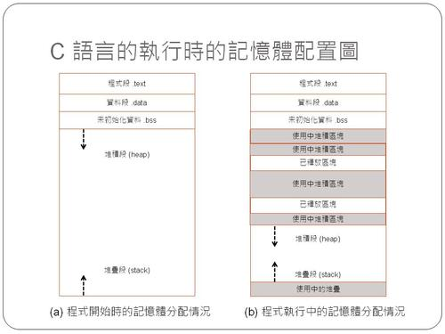

## C 語言的執行環境

程式段 (.text) 主要存放程式的機器碼，資料段 (.data) 則是存放全域變數的資料，BSS 段 (.bss) 存放的是未初始化的全域變數，堆積段 (.heap) 則是在程式使用 malloc 進行記憶體分配時，可以分配的動態記憶空間，而堆疊段 (.stack) 則存放「參數、函數返回點、區域變數、框架指標」等資料。圖一顯示了 C 語言的執行環境，左半部的 (a) 是這五個區段的初始狀況，而右半部的 (b) 則是在程式執行中，堆疊與堆積已經進行某些分配後的狀況。



請讀者將焦點先放在堆疊與堆積這兩段上，C 語言中的「參數、函數返回點、區域變數、框架指標」等資料，被儲存在堆疊段中，這個區段會隨著函數呼叫的層次數目而增長或縮短。如果這個區段成長過頭，導致堆疊段覆蓋到堆積段的空間時，就被稱為堆疊溢位 (Stack Overflow)，這種情況通常是因為程式進行遞回呼叫，卻又沒有正確判斷終止條件，導致遞迴層數過多所產生的錯誤情況。

讓我們將焦點轉到堆積段中，假如我們用 malloc() 函數分配記憶體空間，則 malloc() 函數會從堆積段 (heap) 中找到一個夠大的區塊，分配給 malloc() 函數傳回。然後，當我們使用 free() 函數釋放記憶體空間時，則原先分配的區塊會歸還給堆積系統，此時通常會在堆積的記憶空間中留下一個空洞。在程式的執行過程當中，malloc() 與 free() 會交錯執行，因而導致整個堆積區塊開始產生許多空洞，這將會造成記憶體管理的負擔，假如堆積系統無法找到足夠大的堆積區塊時，就會造成記憶體分配失敗的情況，因而導致程式無法繼續執行。

對於現今的電腦而言，由於記憶體的容量龐大，而且通常有分頁機制可以幫助作業系統進行記憶體管理，因此堆積分配失敗的情況較為少見，但是對於早期的電腦，或者是嵌入式系統而言，堆積的分配就是一個相當難以處理的問題。

在 C 語言的函式庫設計上，通常會盡量避免使用 malloc() 等函數分配堆積空間，因為這會造成記憶體管理的困擾，也會讓程式的執行效率難以預料。因此，您可以看到 C 語言的字串函數，通常會盡可能避免使用 malloc() 函數分配空間。

### 一個誤用的 C 語言字串範例

在 Java 這樣的語言當中，字串的長度是可以改變的，您可能會使用下列程式，很自由的讓字串大小增大，Java 會自動的幫您分配字串所需要的記憶空間，而不會產生太大的問題。

範例一、字串連接的 Java 程式

```java
String s = "";
for (i=0; i<100; i++)
  s = s + token[i];
```

但是在 C 語言當中，您就會遇到一個困擾，假如我要撰寫一個類似的程式，那麼字串 s 的長度應該要設定為多長呢？請看下列範例。

範例二、字串連接的 C 程式

```CPP
char s[1000];
for (i=0; i<100; i++)
  strcat(s, token[i]);
```

您可能會懷疑，長度 1000 到底夠不夠呢？假如 token 陣列中的字串長度平均超過 10 個字，那麼 s 的長度 1000 就會不夠了。這樣看來，Java 的字串函式庫設計似乎比 C 語言要好得多了，不是嗎？

如果您不夠理解 C 語言，就很可能會寫出像範例二這樣的程式，但是這對 C 語言來說其實是一種誤用，誤用的原因是：「想要用靜態的字串處理動態的問題」。

假如您真的必需撰寫像範例二這樣的程式，那麼應該自行設計一個動態的字串函式庫，或者採用某個現成的動態字串函式庫，而不是直接用 C 語言內建的標準函數。但是 C 語言的初學者往往沒有這樣一個函式庫，因而寫出像範例二這樣的程式。

程度稍好的資訊系學生，可能理解到這個問題不能採用靜態的解決方式，因此使用 malloc() 函數進行記憶體分配，以解決這個令人困擾的問題，於是就寫出了下列的程式碼。

範例三、字串連接的 C 程式 (malloc 版)

```CPP
char *s = malloc(1);
s[0] = '\0';
for (i=0; i<100; i++) {
  char *t = malloc(strlen(s)+strlen(token[i])+1);
  sprintf(t, "%s%s", s, token[i]);
  free(s);
  s = t;
}
```

但是這樣撰寫 C 語言，仍然是初學者會犯的錯誤之ㄧ，這種用法完全誤用了 C 語言的能力，造成了很多次的 malloc() 分配，卻又很沒效率的處理字串長度的成長問題。

歸根究底，這個問題是由於 C 語言沒有提供一個標準的動態字串而造成的，如果您真的需要一個這樣的程式，那麼就應該採用一個支援動態字串的函式庫，然後將程式改寫如下。

範例四、字串連接的 C 程式 (動態字串版)

```CPP
Str *s = StrNew();
for (i=0; i<100; i++) {
  StrAppend(s, token[i]);
}
```

這樣範例四的 C 語言程式，其實就與範例一的 Java 程式，看來相差不大了，最大的差別是 C 語言沒有支援物件的概念而已。

### 動態字串

要能撰寫像範例四這樣的一個程式，動態字串函式庫至少要能支援 StrNew() 與 StrAppend() 這兩個函數，那麼我們應該怎麼做呢？其實，要自己打造這樣一個程式相當容易，筆者可以馬上撰寫一個，如範例五所示。

範例五：實作動態字串函式庫

```CPP
typedef struct Str {
  int len, size;
  char *s;
};

Str *StrNew();
void StrAppend(Str *str, char *s);

Str *StrNew() {
  Str *str = malloc(sizeof(Str));
  str->s = malloc(1);
  str->s[0] = '\0';
  str->len = 0;
  str->size = 1;
}

void StrAppend(Str *str, char *s) {
  int newLen = str->len + strlen(s);
  if (newLen+1 > str->size) {
    int newSize = max(str->size*2, newLen+1);
    char *t = malloc(newSize);
    sprintf(t, "%s%s", str->s, s);
    free(str->s);
    str->s = t;
    str->len = newLen;
    str->size = newSize;
  } else {
    strcat(&str->s[str->len], s);
    str->len += strlen(s);
  }
}
```

只要有了這樣一個函式庫，那麼我們就不需要為了 C 語言缺乏動態字串而困擾了，也就不需要每次都寫出像範例二或範例三這樣難看且沒有效率的程式了，而是直接寫出像範例四這樣乾淨，簡潔的函式庫了。

### C 語言標準字串函式庫的設計理念

既然如此，那麼為何 C 語言要設計出像 strcpy(), strcat(), strtok() 這樣的字串函式庫，而不直接使用像上述的動態字串函式庫取代就好了呢？關於這個問題，我們必須回到當初 K & R 兩人設計 C 語言的初始環境，才能看出其原因。

K & R 設計 C 語言時，還沒有物件導向的概念，因此不太可能設計出像範例五這樣具有物件導向概念的字串函式庫。當時電腦的記憶體極為有限，而且 K&R 一心只想設計出 UNIX 作業系統，因此像 strcpy()、strcat()、strtok() 這樣的函數，可以同時支援字串陣列與指標，因而發展出這樣一套 C 語言函式庫。

