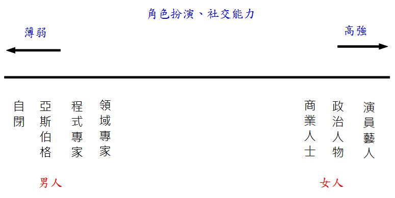

# 論亞斯伯格與程式人的共同特質

## 簡介
 
說到「亞斯伯格」症候群，可能很多人都不知道，但如果說「自閉症」，那應該很多人都可以從字面聯想到一些意義。

以下是維基百科對「亞斯伯格症候群」的解釋：
 
> 亞斯伯格症候群（英語：Asperger syndrome，簡稱AS），又名阿斯伯格綜合征或亞氏保加症，是一種泛自閉症障礙，其重要特徵是社交困難，伴隨著興趣狹隘及重複特定行為，但相較於其他泛自閉症障礙，仍相對保有語言及認知發展。

雖然很多專家認為「亞斯伯格症候群」與「高功能自閉症」是有所區分的，但今天我們不想落入這樣的爭論，
我們只想透過「亞斯伯格」的人格特質，反過來映射到現今高科技領域的一群重要的主體：「程式專業人士」的身上。

因為、我們發現，「程式人的特質」與「亞斯伯格的症狀」之間，有很多類似的特徵，而這些特徵是瞭解「程式人」的
重要線索，我們希望藉由這樣的類比來更進一步瞭解這些「高科技領域」的主角。

透過這樣的類比與對照，我認為有可能揭開「高科技管理」的一些盲點，特別是對於「程式人管理」上，會有重要的啟發。
而且、當我愈深入這個議題時，就愈來愈覺得，如果能夠足夠深入的理解「亞斯伯格」的特質，對很多「深受這種特質困擾」
的「程式人」或「科技專家」而言，將會是一個改善家庭生活的重要關鍵，因為很多「程式人」都深陷在這樣的困境中
而難以掙脫，甚至可能因此而造成「家庭破碎」的問題，這是我之所以要探討這個問題的原因。

## 亞斯伯格的特質
 
在很多探討「自閉症」與「亞斯伯格」的書籍與文章當中，我們大致可以歸納出下列這些特質。

1. 不玩家家酒，無法或不願進行角色扮演遊戲。
2. 無法採用其他人的角度來看事情，同理心有障礙 (也有人說是「缺乏與人情感接觸的能力」)。
3. 對特定領域產生高度專注的固著現像，只想談論該領域的事務，離開該領域後就無所適從 (也有人說是「行為固著、抗拒改變」) 。
4. 難以理解臉部表情、身體語言、以及辦公室政治的微妙互動方式。以及委婉的說法、隱喻、轉喻等曲折的暗示方法。

有幾部電影曾經拍攝關於「自閉症」與「亞斯伯格」相關的主題，像是「雨人，星星的孩子、我的名字叫可汗」等等。
 
而且、原本並不相關的很多心理疾病，例如「自閉症、注意力缺陷多動障礙、躁鬱症、抑鬱症和精神分裂症」等等，經過近來的研究之後，
卻發現似乎有相關的傾向，像是以下文章中就介紹了「 [台灣大學的一項研究](http://www.top1health.com/Article/11750) 」發現以下現象：

> 近日發表於權威期刊「刺胳針」（The Lancet）的研究發現，這些精神疾病在基因上都出現同樣的變異，為精神病醫學研究上的重要發現。
> ...
> 在於DNA中有4個特定區塊與精神疾病都有關，其中有兩種基因已確定在部份的鈣離子通道（calcium channels）上，鈣離子通道為負責傳遞訊息到大腦的神經元。

然而、將這些症狀歸類為疾病，其實容易造成貼標籤的誤導。我認為這種特性只是在「性格與大腦運作機轉之常態分布底下」，
偏向其中一端的情況而已。

根據我所閱讀的資料，我想、如果我們將「自閉」、「亞斯伯格」、「領域專家」、「程式專家」等等排列在「同理心」的軸線光譜中，
我認為很可能會有以下的情況。

當然、勢必有人會問我，以上圖譜的分布有何根據，我只能說，我無法回答，這是我心裏一個直觀的分類法，沒有學術理論或實驗支持，
只有從閱讀的文章中感覺到這樣的傾向而已 (我無意進行任何論戰，我也不是這方面的專家)。

以下是我們歸納出這個圖譜的一些線索：

[自閉症學生特質與醫療介入]

> 自1943、1944年分別由肯納與亞斯柏格兩位學者提出對一群孩童的觀察後，"缺乏與人情感接觸的能力"、"行為固著"、"抗拒改變"等特殊孩童的特質在近幾十年來逐漸被研究重視。而自閉症這個診斷也隨著歷年來對此症狀的更多瞭解逐漸增加，盛行率從2.5~72/萬人都被報告過。由於自閉症是連續性光譜，嚴重度從輕度到重度不等，有些自閉症孩童需在特殊教育環境下接受老師們協助，而有些自閉症孩童則可以在普通班，和一般孩子們相處、學習。

[謎樣自閉症成因揭密！認清3大迷思]

> 大約每1萬人有10到15名自閉症患者，男女患者比例約4:1，通常在幼兒2歲半以前就可以被發現。...
> 
> 台大跨國團隊解開自閉症分子機轉機制，研究發現，拓撲異構酶抑制劑可能會在神經細胞中對基因轉錄的影響，此發現證明以化學物或基因突變的方式而破壞拓撲異構酶，將可導致自閉症及其它神經發育疾病，此結果發表在最新一期Nature期刊中。

[亞斯伯格症是什麼？], 2010-10 親子天下雜誌17期

> 亞斯伯格症（Asperger's syndrome）是自閉症的亞型，屬於廣泛性發展障礙（Pervasive Development Disorder）的一種，主要是神經心理功能異常，導致學習與生活適應困難，男女比約八比一。自閉症的主要特質是「人際互動困難」、「語言溝通困難」與「特殊╱過度執著的行為」。而自閉症亞型的亞斯伯格患者在人際互動上較主動，但技巧差；語言發展大致正常，但不擅於社交溝通；同時對特殊興趣的投入程度相當相當高。

[兩性大腦功能互異 男擅長理解女擅長管理](http://www.epochtimes.com/b5/5/10/29/n1101552.htm)

> 國立陽明大學教授洪蘭今天在一場座談會中表示，女性大腦中管理情緒部分較發達，永遠記得先生的缺點，也比較擅長管理；男性數理觀念則較強，理解能力勝過女性。...
> 
> 洪蘭指出，男女差異從小可發現，例如女生文靜，男生好動調皮，女生愛洋娃娃，男生愛戰爭遊戲，主要受到荷爾蒙分泌影響，就算給男生洋娃娃，男生還是會用洋娃娃來打架。

## 程式人的特質

當我們看清楚上述的「亞斯伯格」症狀之後，再對照到男女大腦的強項與弱點，我們似乎可以對「自閉症患者，男女患者比例約4:1」
與「亞斯伯格症男女比約八比一」這個現像找到一個合理的解釋。

女性大腦對「情緒管理的部分較發達」，而男性大腦對「邏輯理解的能力較強」，這很可能是為何「自閉症」與「亞斯伯格症」男女比例
如此懸殊的原因。

而我們這篇文章中的主角：「程式人」的特質，就可以從這裏看出端倪了！

寫程式是一項需要「高度邏輯推理、理解能力」的工作，因此我們往往在很多「程式開發大會」，像是「Google IO、Microsoft Dev Days」
或者是台灣的「COSCUP、MOPCON、OSDC」等開放原始碼的程式活動中，總是看到人山人海，但大部分的參加者都是男生 (雖人不少招待人員
是女生)。

這種現像與男女大腦的結構似乎有所關聯，因為程式領域需要「高度的邏輯推理、理解能力」，而這正是男生大腦的強項！

但是、當我們看到這些表面現像時，卻往往很容易忽略背後所衍生出來的一些較深層的特性，而這些特性才是本文想探討的重點。

## 程式人的管理

台灣的企業其實不太會管理「程式人」，於是往往用「極權式」的方法對待程式人，結果是程式人被迫在壓力下去做不想做的事情，
而不是讓他們盡力的去發揮自己的專長，自動自發的解決問題，於是我們在「軟體與網路領域的產業」似乎都很難生存，科技也始終
停留在「代工導向」的產業之中。

相反的、像是 Google 、 Amazon、 Apple 與其他矽谷的公司，他們透過「較自由」的方式去讓程式人發揮，因此在「軟體與網路領域的產業」
似乎就表現的比較優秀。

那麼、程式人應該用甚麼方式領導呢？我們能否從「亞斯伯格」的身上得到一些啟發呢？

讓我們在次看看所搜尋到的文獻，看是否能找出一些線索：

[如何理解亞斯伯格孩子]

> 充分了解亞斯伯格孩子的特質，才能對症下藥。一般對亞斯伯格孩子常見的錯誤認知有：一、有暴力攻擊傾向；二、不聽話；三、講出刻薄惡毒的話；四、非常自我中心。
> 易曼解釋，亞斯伯格的孩子在校常因情緒問題而出現攻擊行為，但核心問題源自於他們無法理解社會規則，如「為什麼要排隊？」、「他怎麼可以作弊！」。
> 
>  跟同學起衝突之後，老師愈想制止孩子的行為，他們愈會本能的揮拳亂踢。但其實他們只是用原始的方式反應情緒，並不是有暴力傾向，亞斯伯格孩子長大後反而是常被霸凌的對象。
> 
>  面對大人的指令，亞斯伯格孩子會斬釘截鐵的說「不要」：見長輩不打招呼、上課不聽話、玩遊戲不排隊，完全不給大人面子，其實是因為那些事情對他們毫無意義，抗拒行為就高。
> 
> 曾有個孩子對爺爺懷有敵意，常說出「我要殺死你」等恐怖話語，但其實他不是那個意思，只是不知道如何用言語表達自己的情緒；
> 
> 他也許曾聽過這句話，以為生氣時就是要這樣說。亞斯伯格的孩子無法察言觀色、感同身受，因此同學傷心的哭泣，他們可能還自顧自的哈哈笑，讓人以為他們真沒同理心。

[如何幫助自閉症的孩子-宋維村醫師]

> 如果要比記憶力、精細功能動作等，我比不上自閉症，若比堅持力，我也比不上自閉症及亞斯伯格症。從我自己的角度來看，我們每個人都有所殘缺，因為相對於我們週邊的人，別人都也有比我們好的部分，跟比我好的人相比，我就是殘缺。所以若是以這個觀點來看，我們比較能理解、接受及欣賞所有的孩子。
> 
> 我常常在想，因為現在的科技還沒有辦法把每個人都變成正常，所以比較阿 Q 的想法就是，幫忙他運用他的特長來生活。
> 
> 舉一個很簡當的例子，在科學上有一些重要的人，包括愛因斯坦及牛頓都具有亞斯伯格症的特徵，他們對於某些事情上的執著，可以連續花二十個小時在想一個數學問題；
而一個台灣的天才可能花兩小時，我可能花兩分鐘，想不通就算了，丟掉。
> 
> 所以這些人會成功，執著是很重要的。我們要把這些孩子的特長結合他們的固著性、固執性。尤其是對於亞斯伯格症的孩子，他們的語言、及某些事物上的理解力相當好，
高功能自閉症在機械性的活動上較好，而理解分析的能力較亞斯伯格症差。
> 
> 
如果能利用他們這些特長，很有可能他們將來較能突破現況，而不是一昧的專注於他的人際關係不好。牛頓他半年不換衣服也沒有人管他，他穿同一套衣服長達半年，不管在任何場合，就算是女王要召見他也是一樣。但是這並不損他在物理及數學上的貢獻。

[如何與亞斯伯格症的同學互動]

> 1、簡潔、明確、肯定的表達方式。
> 
> 2、明確告知你不喜歡的，以及你可以接受的其他行為。
> 
> 3、預先告知。

針對以上的這些「對待亞斯伯格」的建議，我覺得在很多方面，或許也是適用在「程式人」身上的，像是可以將
上述的三點歸納為「簡潔、明確、預先告知」，我就認為是與程式人溝通的好方式，

盡可能別假設「程式人」會設身處地的替「同事、下屬或主管」著想，因為這些需要高度的「角色扮演能力與情緒智商 EQ」，
下指令應該態度尊重，但是不要因為「過度考慮個人感受」，而採取委婉迂迴的方式表達，這樣很容易造成訊息的遺失。

### 程式人的家庭問題

如上所述、男生與女生在生理與大腦結構的不同，造成男性對「邏輯理解」較強，但對「情緒理解」較弱，
因此、對於女生而言，男生基本上已經是個「情緒理解障礙者」，難怪會有人寫出「男人來自火星，女人來自金星」
這樣的書籍，來描述男女之間的差異所造成的相互理解問題。

但是、程式人又是落在「社交能力圖譜」當中較左邊的一群，相較於女生落在右邊而言，更是一種不可理解的「外星物種」，
因此、程式人的家庭問題常常也來自於這種「情緒理解障礙」。

身為程式人的妻子，往往因為無法理解丈夫其實是個類似「亞斯伯格症」的患者，所以她們無法理解為何丈夫無法表現出
「體貼、同理心、以及記住她今天穿什麼衣服、情緒是否惡劣」，甚至完全不瞭解她的「暗示、婉轉的陳述」等等，
因而誤認為丈夫不愛她了，或者認為丈夫每天只想寫程式用電腦，完全不管她的感受，也不想陪她，讓她成為「電腦棄婦」。

一但這種情況出現，程式人的家庭經常就會出現危機，「爭執、吵鬧、甚至離婚」等事件就會層出不窮的上演，
當然、如果那位「程式老公」是屬於「高社交能力」型的，這種情況就比較不容易出現，但是「高社交能力型的程式人」
其實並不是大宗，因為「程式人」畢竟是落在「社交能力圖譜」左邊的那一群，也就是社交能力較弱的人。

當然、如果經過訓練，程式人的「社交能力」與「情緒感受力」也會變強，但是若要讓「程式人」變成像「政治人物」或「演員」
這類「高情緒感受力」的人，勢必是有相當困難度的，有時這還可能與遺傳基因有關呢？

所以、在此要提醒那些專注於「程式設計領域」的程式人，別將所有的精神全都投到程式領域裏，還是要留一些「時間與愛」
給家人。否則、當你的程式技術越來越高超的時候，卻發現家庭已經破碎了，那就難以挽回了。

不過、也要提醒那些身為程式人妻子的女生，別期望你的老公會具有像「演員」或「政治人物」一樣的高情緒感受力，
或者像「女生一樣的體貼」，因為你的程式人老公在某種程度上其實是個「亞斯伯格症」患者，要他們展現高度情緒感受力，
其實是違反他們天性的，因為他們的 DNA 裏，其實就已經刻上了「情緒感受力特弱」的標記。

如果、妳的老公沒有辦法理解你的暗示，那就請遵循下列對待亞斯伯格的建議：

> 1、簡潔、明確、肯定的表達方式。
> 
> 2、明確告知你不喜歡的，以及你可以接受的其他行為。
> 
> 3、預先告知。

相信這樣的方法，應該是比較適合「程式人老公」的。

最後、關於這個主題，我在「計算機結構」的課堂上，竟然花了一整節課對「學生們」講解，而且還有錄影，有興趣的人請看下列影片：

* 論亞斯伯格與程式人的共同特質 -- <http://youtu.be/T8WiH4hN4DM>

# 參考資料
* 亞斯伯格症20問 -- <http://www.smjh.tyc.edu.tw/files/as.pdf>
* [亞斯伯格症是什麼？], 2010-10 親子天下雜誌17期
* [自閉症學生特質與醫療介入]
* [謎樣自閉症成因揭密！認清3大迷思]
* [兩性大腦功能互異 男擅長理解女擅長管理]
* [如何理解亞斯伯格孩子]
* [如何幫助自閉症的孩子-宋維村醫師]
* [如何與亞斯伯格症的同學互動]

[自閉症學生特質與醫療介入]:http://kramoi.wordpress.com/2012/09/24/20120920-%E6%96%B0%E5%8C%97%E5%B8%82%E9%B7%BA%E6%B1%9F%E5%9C%8B%E5%B0%8F%E6%BC%94%E8%AC%9B-%E8%87%AA%E9%96%89%E7%97%87%E5%AD%B8%E7%94%9F%E7%89%B9%E8%B3%AA%E8%88%87%E9%86%AB%E7%99%82%E4%BB%8B%E5%85%A5/
[謎樣自閉症成因揭密！認清3大迷思]:http://www.top1health.com/Article/15421
[亞斯伯格症是什麼？]:http://www.parenting.com.tw/article/article.action?id=5020123
[兩性大腦功能互異 男擅長理解女擅長管理]:http://www.epochtimes.com/b5/5/10/29/n1101552.htm
[如何理解亞斯伯格孩子]:http://m.parenting.com.tw/article/article.action?id=5020068
[如何幫助自閉症的孩子-宋維村醫師]:http://www.wretch.cc/blog/asperger/13286720
[如何與亞斯伯格症的同學互動]:http://srv5.mlsh.mlc.edu.tw/~guidance/e-paper/28/health.htm
