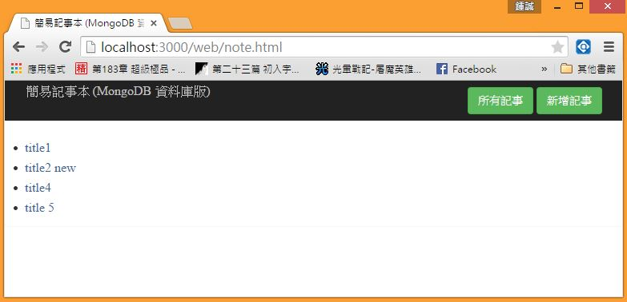
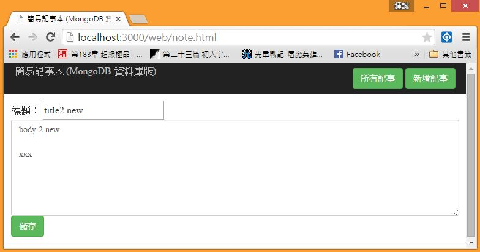
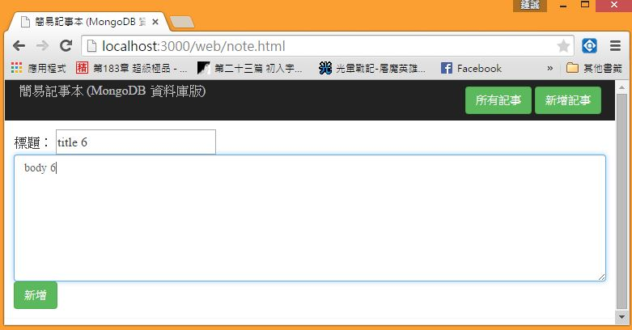

# 專案：簡易記事本

* 檔案下載： [MongoNoteServer.zip](code/MongoNoteServer.zip)
* 專案 -- <https://github.com/ccckmit/MongoNoteServer>

## 簡介

一個簡易的記事系統，採用 koa 當伺服端，並用 mongoDB 儲存記事資料。







## 執行方法

```
> npm install

> iojs MongoNoteServer

After the server startup, you may type http://localhost:3000/ to use the note system.
```

## 後端程式碼 : MongoNoteServer.js

```javascript
var http    = require('http');
var koa     = require('koa');
var bodyParser = require("koa-bodyparser"); // 參考：http://codeforgeek.com/2014/09/handle-get-post-request-express-4/
var fs      = require('mz/fs');
var route   = require('koa-route');
var co      = require('co');
var monk    = require('monk');
var comonk  = require('co-monk');
var db      = monk('localhost/test');
var notes   = comonk(db.get('notes'));
var c       = console;

var app = koa();
app.use(bodyParser());


function response(res, code, msg) {
  res.status = code;
  res.set({'Content-Length':''+msg.length,'Content-Type':'text/plain'});
  res.body = msg;
  c.log("response: code="+code+"\n"+msg+"\n");
}

app.use(route.get('/', function*() {
  this.redirect('/web/note.html');
}));

var mime = { ".css":"text/css", ".html": "text/html", ".htm":"text/html", ".jpg":"image/jpg", ".png":"image/png", ".gif":"image/gif", ".pdf":"application/pdf"};

function fileMimeType(path) {
  for (var tail in mime) {
    if (path.endsWith(tail))
      return mime[tail];
  }
}

app.use(route.get(/\/web\/.*/, function *toStatic() {
  var req = this.request, res = this.response;
  c.log('get %s', this.path);
  var mimetype = fileMimeType(this.path)
  if (mimetype) this.type = mimetype+";";
  this.body = fs.createReadStream(__dirname+this.path);
}));

app.use(route.get("/list", function *list() {
  c.log("/list path=%s", this.path);
  var objs = yield notes.find({}); // 查出所有記事
  c.log("objs=%j", objs);
  response(this.response, 200, JSON.stringify(objs));
}));

app.use(route.get("/note/:id", function *edit(id) {
  var obj = yield notes.findOne({_id:id}); // 查出所有記事
  response(this.response, 200, JSON.stringify(obj));
}));

app.use(route.post("/note/:id", function *save(id) {
  var title = this.request.body.title;
  var body = this.request.body.body;
  var obj = { title:title, body:body };
  yield notes.update({_id:id}, obj);
  response(this.response, 200, JSON.stringify(obj));
}));

app.use(route.post('/new', function *newNote() {
  var title = this.request.body.title;
  var body = this.request.body.body;
  c.log('post %s:%s', title, body);
  yield notes.insert({title:title, body:body});
  response(this.response, 200, 'write success!');
}));

http.createServer(app.callback()).listen(3000);

c.log("noteServer started at port : 3000");
```

## 前端程式碼 : note.html

```html
<html>
<head>
  <meta charset="utf-8" />
  <link href="favicon.ico" rel="icon">
  <link href="http://maxcdn.bootstrapcdn.com/bootstrap/3.3.4/css/bootstrap.min.css" rel="stylesheet">
  <link href="main.css" rel="stylesheet">
  <title>簡易記事本 (MongoDB 資料庫版)</title>
</head>
<body onload="init()">
  <nav class="navbar navbar-inverse navbar-fixed-top">
    <div class="container">
      <button type="button" class="navbar-toggle collapsed" data-toggle="collapse" data-target="#navbar" aria-expanded="false" aria-controls="navbar">
        <span class="sr-only">Toggle navigation</span>
        <span class="icon-bar"></span>
        <span class="icon-bar"></span>
        <span class="icon-bar"></span>
      </button>
      <div class="navbar-header" style="color:#C0C0C0">
        簡易記事本 (MongoDB 資料庫版)
      </div>
      <div id="navbar" class="navbar-collapse collapse">
        <form class="navbar-form navbar-right">
          <div class="form-group">
            <input id="filepath" type="hidden" class="form-control" placeholder="filepath" aria-describedby="basic-addon1">
            <button class="btn btn-success" type="button" onclick="list()">所有記事</button>
            <button class="btn btn-success" type="button" onclick="newNote()">新增記事</button>
          </div>
        </form>     
      </div>
    </div>
  </nav>

  <div id="panelList" class="tab-pane panel">
  </div>
  <div id="panelEdit" class="tab-pane panel">
    標題： <input id="editTitle" type="text" value="">
    <br/>
    <textarea id="editBody" class="form-control" style="width:100%; height:60%"></textarea>
    <button class="btn btn-success" onclick="save()">儲存</button>
  </div>
  <div id="panelNew" class="tab-pane panel">
    標題： <input id="newTitle" type="text" value="">
    <br/>
    <textarea id="newBody" class="form-control" style="width:100%; height:60%"></textarea>
    <button class="btn btn-success" onclick="add()">新增</button>
  </div>
  <script src="https://ajax.googleapis.com/ajax/libs/jquery/1.11.2/jquery.min.js"></script>
  <script src="http://maxcdn.bootstrapcdn.com/bootstrap/3.3.4/js/bootstrap.min.js"></script>
<script>
$('.panel').css( "display", "none");

Server = {
  timeout : 4000
};

Server.save=function(file, text) {
  $.ajax({
    type: "POST",
    url: "/note/"+file,
    timeout: this.timeout,
    data: { text: text }
  })
  .done(function(data) {
    alert( "存檔完成!");
  })
  .fail(function() {
    alert( "存檔失敗！" );
  });
}

Server.load=function(file) {
  return $.ajax({
    type: "GET",
    url: "/note/"+file,
    timeout: this.timeout,
    data: {}
  });
}

function init() {
  list();
}

function switchPanel(name) {
  $('.panel').css( "display", "none");
  $('#'+name).css( "display", "block");
}

function list() {
  switchPanel('panelList');
  $.ajax({
    type: "GET",
    url: "/list",
    timeout: this.timeout,
    data: {}
  })
  .done(function(data) {
    var notes = JSON.parse(data);
		$('#panelList').empty();
		$('#panelList').append("<ol>");
    for (var i in notes) {
      $('#panelList').append('<li><a href="javascript:edit(\''+notes[i]._id+'\')">'+notes[i].title+"</a></li>")
    }
		$('#panelList').append("</ol>");
  });
}

var noteID;

function edit(id) {
  switchPanel('panelEdit');
	noteID = id;
  $.ajax({
    type: "GET",
    url: "/note/"+id,
    timeout: this.timeout,
    data: {}
  })
  .done(function(data) {
    var note = JSON.parse(data);
    $('#editTitle').val(note.title);
    $('#editBody').val(note.body);
  });
}

function save() {
  var title = $('#editTitle').val();
  var body  = $('#editBody').val();
  $.ajax({
    type: "POST",
    url: "/note/"+noteID,
    timeout: this.timeout,
    data: {
      title:title,
			body:body
    }
  })
  .done(function(data) {
	  alert('存檔完成!');
	});
}

function newNote() {
  switchPanel('panelNew');
  $('#editTitle').val('');
  $('#editBody').val('');
}

function add() {
  var title = $('#newTitle').val();
  var body  = $('#newBody').val();
  $.ajax({
    type: "POST",
    url: "/new",
    timeout: this.timeout,
    data: {
      title:title,
			body:body
    }
  })
  .done(function(data) {
	  alert('新增完成!');
		list();
	});
}

</script>
</body>
</html>


```

