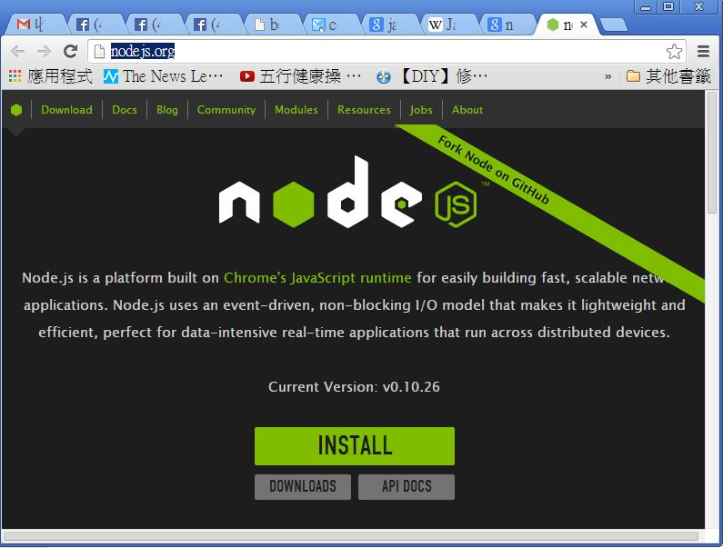
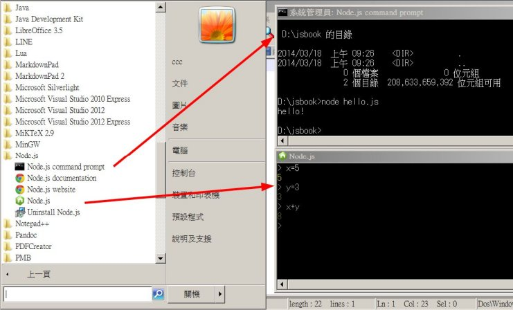
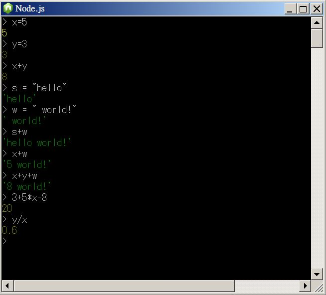
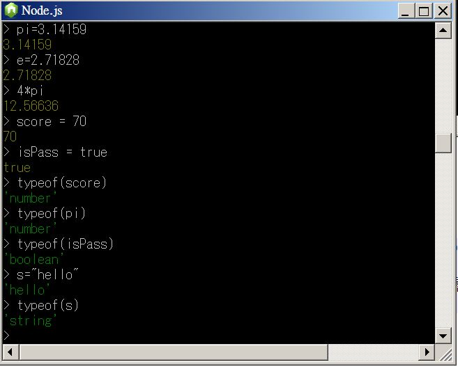

## 用 Node.js 學 JavaScript 語言


<iframe width="800" height="600" src="https://www.youtube.com/embed/2yJkml9TfVs" frameborder="0" allowfullscreen></iframe>


### 簡介

Node.js 是 Ryan Dahl 基於 Google 的 V8 引擎於 2009 年釋出的一個 JavaScript 開發平台，主要聚焦於 Web 程式的開發，通常用被來寫網站。

但是、要開發網站就勢必要把「 HTML, CSS, Web」等等技術扯進來，這對那些單純想用 JavaScript 做為第一門語言的學習者而言，勢必是非常困擾的。有鑑於此，我們將撰寫一系列用 Node.js 學基礎 JavaScript 語法的文章，以便讓初學者也能透過 Node.js 這個環境學會 JavaScript 語言。

### node.js 的安裝

您可以 node.js 的官方網站中下載並安裝此一開發環境，網址如下：

* <http://nodejs.org/>



您可以點入官網的 INSTALL 連結下載安裝程式，然後一直按下一步就可以安裝完成了。(筆者所使用的環境是 Windows 7，所以下載時會得到 windows 版的安裝檔，例如 node-v0.10.26-x64.msi 這樣的檔案)。

筆者在 Windows 7 中安裝完成之後，點選「開始/所有程式/node.js」可以看到如下畫面：



在上圖中，我們點選了 `node.js command prompt` 起動了一個命令列環境，然後寫了一個 hello.js 的程式如下。

檔案： hello.js

```javascript
console.log("hello!");
```

我們將 hello.js 檔案放在 `D:\jsbook\` 這個資料夾裏面，接著用 `node hello.js` 這個指令執行該程式，於是畫面中會出現該程式的執行結果，印出 `hello!` 訊息！

然後在右下半部的圖片中，我們點選了綠色圖示的 `node.js` 交談環境，接著輸入一些簡單的指令，這個環境可以讓您很容易的與 node.js 互動，試驗一下 JavaScript 指令的執行結果。

### 變數與指定

要學習一個程式語言，通常必須從變數宣告開始，變數可以想像成用來存放一些值的容器。舉例而言，當我們寫下 x=5 的時候，就是在 x 這個變數裏，放入 5 這個數值，同樣的我們也可以設定變數 y 為 3。

為了學習這些慨念，請您打開「開始/所有程式/node.js」這個綠色圖示的程式，然後輸入下列指令看看：



您可以看到在上述操作中，我們宣告了 x,y,s,w 等變數，其中 `x=3, y=5, s="hello", w=" world!"` ，由於 x,y 都被指定為整數，因此可以進行加減乘除的運算，而 s,w 則被指定為字串，因此只能執行連接運算，在 JavaScript 中的字串連接也是採用加法符號 `+` 表示的。

### 基本型態

JavaScript 的變數，可以是「數值 (Number)、字串 (String) 、布林 (Boolean) 、陣列 (Array) 或物件 (Object)」等型態，其中的陣列與物件是複合型態，其他三種為基本型態，以下是一些關於基本型態的操作指令。



### 結語

在本文中，我們從安裝 node.js 開始，介紹了如何使用 node.js 開發環境，以及最基本的 JavaScript 程式觀念。在下一期當中，我們將介紹 if, for, while 等流程控制語法的概念，然後再介紹函數這個基本的模組化概念。

