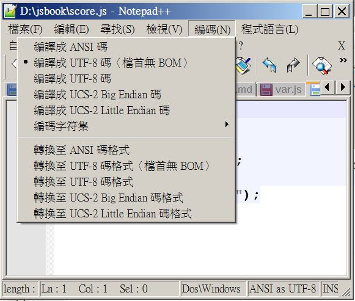
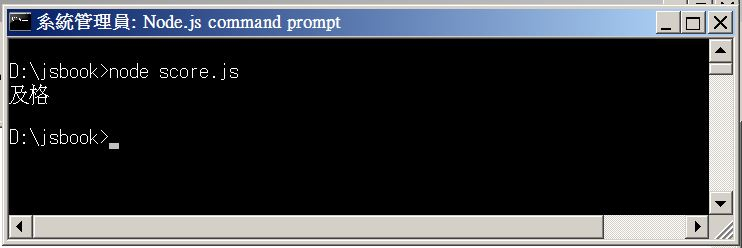

# 用 Node.js 學 JavaScript 語言 (2) -- 基本控制

在本文當中，我們將繼續介紹 JavaScript 的語法，包含控制邏輯與迴圈等等。

## if 判斷

JavaScript 的 if 語句，和 C 語言幾乎一樣。舉例而言，下列程式可以根據 score 所設的定分數，來印出「及格」或「不及格」的訊息，只要大於 60 分，就算是及格了。

檔案：score.js

```javascript
var score = 61;

if (score >= 60)
  console.log("及格");
else
  console.log("不及格");
```

寫完上述程式之後，請務必將檔案儲存成 UTF8 的格式 (Unicode 8 位元模式) ，我的習慣是採用 Notepad++ 這個編輯器，然後儲存成「UTF8 檔首無 BOM」的格式，如下圖所示：



這樣，程式就可以正常印出「繁體中文」，結果如下所示：



如果您沒有儲存成 UTF8 的格式，而是用預設的 ANSI 格式，那麼印出來的中文就會看不到 (或者變成亂碼)，如下圖所示，這是因為 node.js 預設採用 UTF8 編碼的緣故。


因此請務必要將檔案儲存成 UTF8 格式，這樣會比較不容易出錯。

練習：請執行完上述程式之後，將 score 改為 56，再重新執行一次，看看會印出甚麼？

## 兩種相等判斷

在 javascript 當中，比較特別的一件事情是，是否相等的判斷通常有兩種，一種是兩個等號的 `==` ，另一種是參個等號的 `===`。

這兩種判斷到底差別在哪裡呢？答案是：三個等號者會判斷型態是否相等，因此是嚴格的相等，而兩個等號者不會判斷型態，因此是不嚴格的相等，以下範例說明了兩者的差異。

檔案：equals.js

```javascript
console.log('"30"==30 is ', "30" == 30);
console.log('"30"!=30 is ', "30" != 30);
console.log('"30"===30 is ', "30" === 30);
console.log('"30"!==30 is ', "30" !== 30);
```

執行結果：

```
D:\js\code>node equals.js
"30"==30 is  true
"30"!=30 is  false
"30"===30 is  false
"30"!==30 is  true
```

## while 迴圈

JavaScript 的迴圈與 C 是非常像的，包含 while 與 for 語句都幾乎是一樣的。以下是一個 JavaScript 的 while 迴圈範例。

檔案：while.js

```javascript
i=1;
while (i<=10) {
  console.log("i=", i);
  i = i + 1;
}
```

執行結果：

```
D:\jsbook>node while
i= 1
i= 2
i= 3
i= 4
i= 5
i= 6
i= 7
i= 8
i= 9
i= 10
```

如果我們在從 1 數到 10 的過程當中，把變數 i 進行累加，那麼就可以得到累加總和， 1+..+10 = 55 的結果如下。

檔案：whilesum.js

```javascript
sum=0;
i=1;
while (i<=10) {
  sum = sum + i;
  console.log("i=", i, " sum=", sum);
  i = i + 1;
}
```

執行結果

```
D:\jsbook>node whilesum
i= 1  sum= 1
i= 2  sum= 3
i= 3  sum= 6
i= 4  sum= 10
i= 5  sum= 15
i= 6  sum= 21
i= 7  sum= 28
i= 8  sum= 36
i= 9  sum= 45
i= 10  sum= 55
```

## for 迴圈

檔案：for.js

```javascript
for (i=1;i<=10;i++) {
  console.log("i=", i);
}
```

執行結果：

```
D:\jsbook>node for.js
i= 1
i= 2
i= 3
i= 4
i= 5
i= 6
i= 7
i= 8
i= 9
i= 10
```

當然、同樣的事情也可以用 for 迴圈來做，這種寫法會更短更簡潔，以下是採用 for 進行 1+...+10 的範例。

檔案：sum.js

```javascript
sum=0;
for (i=1;i<=10;i++) {
  sum = sum + i;
  console.log("i=", i, " sum=", sum);
}
```

執行結果：

```
D:\jsbook>node sum.js
i= 1  sum= 1
i= 2  sum= 3
i= 3  sum= 6
i= 4  sum= 10
i= 5  sum= 15
i= 6  sum= 21
i= 7  sum= 28
i= 8  sum= 36
i= 9  sum= 45
i= 10  sum= 55
```

另外、 javascript 也從 C 語言那裏繼承了 continue 與 break 等語句，遇到 continue 時會回到迴圈開頭，忽略後面語句。而遇到 break 時則會跳出迴圈。

檔案：forbreak.js

```javascript
for (i=1;i<=10;i++) {
  if (i == 3) continue;
  if (i == 8) break;
  console.log("i="+i);
}
```

執行結果：

```
D:\jsbook>node forbreak.js
i=1
i=2
i=4
i=5
i=6
i=7
```

## 陣列

JavaScript 的陣列宣告非常簡單，就是用 `[...]` 所框起來的一連串資料，或者您也可以用 `new Array()` 語句來建立一個空的陣列，而且可以用 length 屬性來取得陣列大小。

檔案：array.js

```javascript
var a=[1,6,2,5,3,6,1];

for (i=0;i<a.length;i++) {
  console.log("a[%d]=%d", i, a[i]);
}
```

執行結果

```
D:\jsbook>node array.js
a[0]=1
a[1]=6
a[2]=2
a[3]=5
a[4]=3
a[5]=6
a[6]=1
```

當然、javascript 有些語法是 C 語言所沒有的，像是 JavaScript 的 foreach 語句採用 `for (i in c)` 這樣的語法，其中的 c 必須是個陣列或容器，而 i 則是索引值 (注意、不是內容，是索引值)，以下是這種語句的一個範例。

檔案：foreach.js

```javascript
var a=[1,6,2,5,3,6,1];

for (i in a) {
  console.log("a[%d]=%d", i, a[i]);
}
```

執行結果

```
D:\jsbook>node foreach
a[0]=1
a[1]=6
a[2]=2
a[3]=5
a[4]=3
a[5]=6
a[6]=1
```

接著、請讀者可以思考並嘗試一下，如何撰寫下列的兩個程式。

習題 1：請寫一個程式可以將兩個陣列 a=[1,2,3] b=[3,2,1] 相加。

習題 2：請寫一個程式可以計算兩個向量 a=[1,2,3] b=[3,2,1] 的內積。


## 二維陣列

當然、我們也可以宣告二維、三維、甚至更高維的陣列，以下是一個將二為陣列格式化為字串後印出來的範例。

檔案：array2D.js

```javascript
var a=[[1,6,2],
       [5,3,6]];

for (var i=0; i<a.length; i++) {
  var line = "";
  for (var j=0; j<a[i].length; j++) {
    line = line + a[i][j] + " ";
  }
  console.log(line);
}
```

執行結果

```
D:\jsbook>node array2D
1 6 2
5 3 6
```

看了上述範例之後，也建議讀者可以嘗試一下撰寫下列程式。

習題 1：請寫一個程式可以將兩個矩陣 a=[[1,2,3], [2,3,4]] b=[[1,1],[2,2],[3,3]] 相加。

習題 2：請寫一個程式可以將兩個矩陣 a=[[1,2,3], [2,3,4]] b=[[1,1],[2,2],[3,3]] 相乘 (內積)。

## 字典 (物件)

雖然上述這些 JavaScript 的語法很像 C 語言，但是 JavaScript 本質上仍然是個動態語言，其特性比較像 Python、 Ruby 等語言，因此預設就有提供更高階的資料結構，其中最重要的一個就是字典 (dictonary)，字典中的基本元素是 (key, value) 的配對，我們只要將 key 傳入就可以取得 value 的値，以下是一個 JavaScript 的字典範例。

檔案：dict.js

```javascript
var dict={ name:"john", age:30 };

dict["email"] = "john@gmail.com";
dict.tel = "02-12345678";

for (var key in dict) {
  console.log("key=", key, " value=", dict[key]);
}

console.log("age=", dict.age);
console.log("birthday=", dict["birthday"]);
```

執行結果

```
D:\js\code>node dict.js
key= name  value= john
key= age  value= 30
key= email  value= john@gmail.com
key= tel  value= 02-12345678
age= 30
birthday= undefined
```

## 結語

在本章中，我們介紹了「變數、運算式、if 判斷式, for 與 while 迴圈」，還有「陣列與字典物件」等基礎語法，學會這些語法之後，就可以寫一些基礎的小程式了。

但是若要寫出更好、更模組化的程式，那就還需要學會「函數與物件導向」的寫法，這將是下一章的主題。
