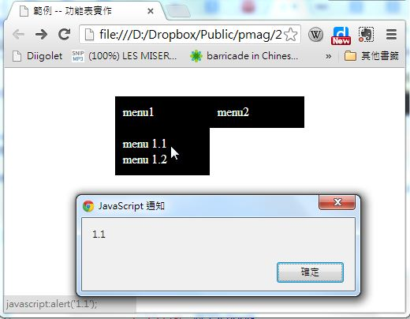
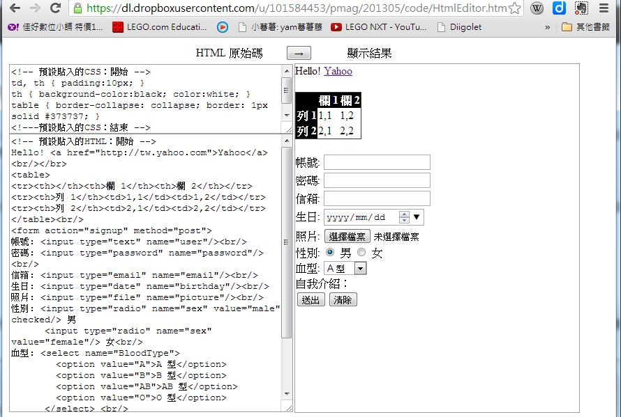

# 動態網頁 - JavaScript 在瀏覽器中控制 DOM 網頁物件

## JavaScript、Browser 與 DOM

JavaScript 之所以重要，是因為 JavaScript 是瀏覽器當中規定的標準語言。這是因為早期的瀏覽器 Netscape 將 JavaScript 內建於其中，
以變能夠進行一些互動程式的效果，因此才讓 JavaScript 成為瀏覽器的的標準語言。

在瀏覽器中，要用 JavaScript 設計出互動效果，畢需借助 DOM (Document Object Model) 這個 HTML 的抽象化物件模型，這個模型將
整個 HTML 文件視為一個樹狀結構的物件，於是 JavaScript 可以透過操控物件屬性的方式，達成某些互動性的顯示效果。這種互動性的
顯示效果形成了瀏覽器特有的視覺化互動模式，可以說是近 15 年來 Web 的發展重點之所在。

接著、就讓我們透過一些簡單的程式範例，看看如何用 JavaScript 操控 DOM 物件模型，以便完成這種互動效果。

### 取得內容：innerText 與 innerHTML

以下範例會取得 hi 節點的 innerText 與 innerHTML 顯示出來，請觀察其不同點。

```html
<html>
  <head>
    <title>節點存取示範</title>
  </head>
  <body>
    <div id ="hi"><b>你好!</b></div>
    <input type="button" value="hi.innerText" 
             onclick="alert(document.getElementById('hi').innerText)");
    <input type="button" value="hi.innerHTML" 
             onclick="alert(document.getElementById('hi').innerHTML)");
  </body>
</html>
```

### 顯示與隱藏 (Show and hide)

```html
<html>
  <head>
    <title>範例 -- 顯示隱藏</title>
  </head>
  <body>
    <div id ="hi"><b>你好!</b></div>
    <input type="button" value="hi.show()" onclick="document.getElementById('hi').style.visibility='visible'");
    <input type="button" value="hi.hide()" onclick="document.getElementById('hi').style.visibility='hidden'");
  </body>
</html>
```

## 功能表程式

JavaScript 是唯一被各家瀏覽器所共同支援的程式語言，因此在設計網站的時候，我們如果不採用像 Flash 或 Silverlight 這樣的外掛技術，就必須採用 JavaScript 來設計互動式網頁。

在 node.js 這樣的伺服端 JavaScript 開發平台推出之後，我們就能夠採用 JavaScript 同時設計 Client 端與 Server 端的程式，這樣的模式相當的吸引人，我們會在後續的文章中介紹這樣的網站設計方法。

在本節當中，我們將透過 JavaScript 設計一個互動網頁的功能表，以便展示瀏覽器中的 JavaScript 程式是如何運作的。

以下是一個功能表的程式的執行結果，當我們的滑鼠移到功能項上時，就會浮現子功能表，而當我們點下子功能表中的項目時，就會出現一個 alert 視窗，顯示該功能子項被點選的訊息。



以下是這個網頁的原始 HTML 程式碼，其中 `<style>...</style>` 部分是 CSS 原始碼，而 `<script ...</script>` 部分則是 JavaScript 程式碼。

```html
<html>
<head>
<title>範例 -- 功能表實作</title>
<style>
.menu   { background-color:black; color:white; padding:10px; 
          vertical-align:top; width:100px; list-style-type:none; }
.menu a { color:white; text-decoration:none; }
</style>
<script type="text/javascript">
function show(id) {
  document.getElementById(id).style.visibility='visible';
}
 
function hide(id) {
  document.getElementById(id).style.visibility='hidden';
}
</script>    
  </head>
  <body onload="JavaScript:hide('popup1');hide('popup2');">
      <ul onmouseover="show('popup1');"  onmouseout="hide('popup1')" 
          style="position:absolute; left:100px; top:20px">
        <li id="menu1" class="menu">menu1</li>
        <ul id="popup1" class="menu">
          <li><a href="JavaScript:alert('1.1');">menu 1.1</a></li>
          <li><a href="JavaScript:alert('1.2');">menu 1.2</a></li>
        </ul> 
      </ul>
      <ul onmouseover="show('popup2');" onmouseout="hide('popup2')" 
          style="position:absolute; left:220px; top:20px">
        <li id="menu2" class="menu">menu2</li>
        <ul id="popup2" class="menu">
          <li><a href="JavaScript:alert('2.1');">menu 2.1</a></li>
          <li><a href="JavaScript:alert('2.2');">menu 2.2</a></li>
          <li><a href="JavaScript:alert('2.3');">menu 2.3</a></li>
        </ul>
      </ul>
  </body>
</html>
```

雖然以上程式只是一個小小的功能表程式碼，但是要能夠讀懂，而且寫得出來，卻要懂相當多的技術才行，這些技術包含 HTML, CSS , JavaScript 與 Document Object Model (DOM)。


### 程式解析

在 HTML 的一開始，我們用以下語法描述了功能表所需要的 CSS 樣式，當我們套用在像 `<li id="menu2" class="menu">menu2</li>` 這樣的 HTML 項目上時，就會呈現比較好看的功能表排版格式，而這正是 CSS 樣式的功用。

```html
<style>
.menu   { background-color:black; color:white; padding:10px; 
          vertical-align:top; width:100px; list-style-type:none; }
.menu a { color:white; text-decoration:none; }
</style>

```

以上的 CSS 語法中，要求功能表要以黑底白字的方式 (`background-color:black; color:white;`) 顯示，邊緣補上 10 點的空白(`padding:10px;`)，而且是以向上靠攏 (`vertical-align:top;`) 的方式，每個功能表的寬度都是 100 點 (`width:100px;`)，然後不要顯示項目前面的點符號 (`list-style-type:none;`)。

接著是一段 JavaScript 程式碼的語法，定義了 show(id) 與 hide(id) 這兩個函數，我們可以用這兩個函數在適當的時候讓功能表顯示出來或者是隱藏掉，這樣才能做到「浮現」的功能。

```html
<script type="text/javascript">
function show(id) {
  document.getElementById(id).style.visibility='visible';
}
 
function hide(id) {
  document.getElementById(id).style.visibility='hidden';
}
</script>    
```

然後，開始進入 HTML 的 body 區塊，其中定義了兩組功能表，第一組的內容如下：

```html
      <ul onmouseover="show('popup1');"  onmouseout="hide('popup1')" 
          style="position:absolute; left:100px; top:20px">
        <li id="menu1" class="menu">menu1</li>
        <ul id="popup1" class="menu">
          <li><a href="JavaScript:alert('1.1');">menu 1.1</a></li>
          <li><a href="JavaScript:alert('1.2');">menu 1.2</a></li>
        </ul> 
      </ul>
```

上述區塊最外層的 `<ul>...</ul>` 定義了整個功能表的結構，是由功能母項 `<li id="menu1" class="menu">menu1</li>` 與子功能表 `<ul id="popup1" class="menu">...</ul>` 所組合而成的，而 `<ul onmouseover="show('popup1');"  onmouseout="hide('popup1')" style="position:absolute; left:100px; top:20px">` 這一段除了定義了該功能表要顯示在絕對位置 (100,20) 的地方之外，還定義了 onmouseover 與 onmouseout 的事件，這兩個事件讓功能表可以在滑鼠移入時顯示出來，然後在滑鼠移出時隱藏起來，因而做到了浮現式功能表所要求的條件。

由於我們在 `<li>...</li>` 內的超連結 `<a href="JavaScript:alert('2.1');">menu 2.1</a>` 使用了 JavaScript 語法，因此在該超連結被點選時，就會有警告視窗顯示 2.1 的訊息，這個訊息僅僅是讓我們知道該功能項被點選了而已，沒有真實的功能。

同樣的、第二個功能表的程式碼也是非常類似的，請讀者看看是否能夠讀者其內容。

```html
      <ul onmouseover="show('popup2');" onmouseout="hide('popup2')" 
          style="position:absolute; left:220px; top:20px">
        <li id="menu2" class="menu">menu2</li>
        <ul id="popup2" class="menu">
          <li><a href="JavaScript:alert('2.1');">menu 2.1</a></li>
          <li><a href="JavaScript:alert('2.2');">menu 2.2</a></li>
          <li><a href="JavaScript:alert('2.3');">menu 2.3</a></li>
        </ul>
      </ul>
```

看到這裡，讀者應該大致理解了上述功能表網頁的運作原理，但事實上、我們還漏掉了一行重要的程式碼，那就是 `<body onload="JavaScript:hide('popup1');hide('popup2');">` 這一行，這一行讓浮現功能表能在一開始就處於隱藏狀態，才不會一進來就看到兩個功能表都浮現出來的錯誤情況。


### 小結

從上述範例中，您可以看到瀏覽器中的 JavaScript ，通常是透過調整網頁某些項目的 CSS 屬性，以達成互動性的功能，這種互動網頁技術，事實上是結合了 HTML+CSS+JavaScript 等技術才能達成的功能，因此這三項技術在瀏覽器當中幾乎是合為一體、可以說是缺一不可的。

在本期中我們說明了互動式網頁的設計方式，但這樣的設計方式非常冗長，對程式人員而言是很大的負擔，因此在互動網頁興起之後，就逐漸出現了各式各樣的互動性 JavaScript 框架，也就是現成的 JavaScript 函式庫，讓我們可以輕易做出很好的互動性，像是 jQuery, ExtJS, YUI, Prototype, Dojo 等互動性函式庫，以便減輕 JavaScript 程式人員的負擔，增加程式員的生產力，在下一期當中，我們將使用最常被使用的 jQuery 框架，再度說明互動網頁的寫法，我們下期見！


## HTML 編輯器

在本節當中，我們將透過 JavaScript 設計一個 HTML 編輯器，讓您可以直接在瀏覽器當中看到 HTML 網頁的呈現結果，
筆者認為這個範例對學習動態網頁設計是一個非常簡單、卻又很有啟發性的程式。因為他很明顯的展現了動態網頁的原理。

以下是該 HTML 編輯器的執行結果，當我們在 CSS 與 HTML 區塊輸入對應的原始碼之後，就可以按下「→」按鈕，然後在
呈現的 `<div id="showbox" ...</div>` 區塊看到兩者搭配時的呈現結果。



您也可以點選下列連結以實際檢視該網頁：

* HTML 編輯器：<https://dl.dropboxusercontent.com/u/101584453/pmag/201305/code/HtmlEditor.htm>

以下是這個網頁的原始 HTML 程式碼，其中有兩大段是我們預設填入的 CSS 與 HTML 原始碼，這兩段原則上可以去掉，但是
為了測試方便起見，我們就留在檔案中，請讀者閱讀的時候仔細區分之。

```html
<html>
<style>
textarea, #showbox { border: 1px solid #9f9f9f; }
</style>
<style id="showboxstyle">
</style>
<script type="text/javascript">
function convert() {
  var cssbox  = document.getElementById("cssbox");
  var editbox = document.getElementById("editbox");
  var showbox = document.getElementById("showbox");
  var showboxstyle = document.getElementById("showboxstyle");
  showbox.innerHTML = editbox.value;
  showboxstyle.innerHTML = cssbox.value;
}
</script>	
<body>
<form>
<table width="95%" style="border-collapse: collapse; border: 0px;"><tr>
<tr><td colspan="2" style="text-align:center">HTML 原始碼　　<input type="button" value=" → " onclick="JavaScript:convert()"/>　　　顯示結果</td></tr>
<td width="50%">
<textarea id="cssbox" style="width:100%; height:100px;" >
<!-- 預設貼入的CSS：開始 -->
td, th { padding:10px; }
th { background-color:black; color:white; }
table { border-collapse: collapse; border: 1px solid #373737; }
<!---預設貼入的CSS：結束 -->
</textarea>
<textarea id="editbox" style="width:100%; height:400px;">
<!-- 預設貼入的HTML：開始 -->
Hello! <a href="http://tw.yahoo.com">Yahoo</a><br/></br>
<table>
<tr><th></th><th>欄 1</th><th>欄 2</th></tr>
<tr><th>列 1</th><td>1,1</td><td>1,2</td></tr>
<tr><th>列 2</th><td>2,1</td><td>2,2</td></tr>
</table><br/>
<form action="signup" method="post">
帳號: <input type="text" name="user"/><br/>
密碼: <input type="password" name="password"/><br/>
信箱: <input type="email" name="email"/><br/>
生日: <input type="date" name="birthday"/><br/>
照片: <input type="file" name="picture"/><br/>
性別: <input type="radio" name="sex" value="male" checked/> 男
      <input type="radio" name="sex" value="female"/> 女<br/>
血型: <select name="BloodType">
        <option value="A">A 型</option>
        <option value="B">B 型</option>
        <option value="AB">AB 型</option>
        <option value="O">O 型</option>
      </select> <br/>
自我介紹： <br/>
<input type="submit" value="送出"/><input type="reset" value="清除"/><br/>
</form>
<!-- 預設貼入的HTML：結束 -->
</textarea> 
</td>
<td>
<div id="showbox" style="width:100%; height:500px;">
</div>
</td>
</tr></table>
</form>
</body>
</html>

```

### 程式解析

上述程式當中有三個主要的區塊，分別是：

1. CSS 填入區塊： `<textarea id="cssbox" ...</textarea>`
2. HTML 填入區塊：`<textarea id="editbox" ...</textarea>` 
3. HTML 顯示區塊：`<div id="showbox" ... </div>`

此網頁的核心程式部分真的很簡單，只有如下短短的一小段：

1. 利用 `var editbox = document.getElementById("editbox");` 取得 HTML 區塊內容
2. 利用 `showbox.innerHTML = editbox.value;` 這個指令將該 HTML 原始碼填入 showbox 當中

這樣就完成顯示 HTML 的動作了。

```javascript
function convert() {
  var cssbox  = document.getElementById("cssbox");
  var editbox = document.getElementById("editbox");
  var showbox = document.getElementById("showbox");
  var showboxstyle = document.getElementById("showboxstyle");
  showbox.innerHTML = editbox.value;
  showboxstyle.innerHTML = cssbox.value;
}
```

但是這樣作並沒有加入 cssbox 的內容到 HTML 當中，因此我們加入了下列原始碼：

1. 在整個網頁的頭部事先用 `<style id="showboxstyle">...</style>` 這個標記加入一個 CSS style 顯示區塊
2. 利用 `showboxstyle.innerHTML = cssbox.value` 這個指令將 cssbox 的內容填入到該表頭的 style 區塊中

這樣就達成了套用 CSS 內容到網頁中的目的，完成了整個 HTML 編輯器的功能。

### 小結

在本節中，我們用非常簡單的程式，建構了一個 HTML 編輯器。事實上我們只不過是把網頁內容從編輯區域移動到顯示區域，然後流覽器就會
自動解釋這些內容進行呈現了。

在本系列的文章中，關於瀏覽器部分的 JavaScript 程式，我們將至此告一個段落，在下一期當中，我們將開始進入伺服端的 javascript 程式。
我們將利用 node.js 這個伺服端 JavaScript 執行平台，進一步探索 JavaScript 程式的奧秘，我們下期見！


## 參考文獻

* <http://stackoverflow.com/questions/1720320/how-to-dynamically-create-css-class-in-javascript-and-apply>
* <http://dev.opera.com/articles/view/dynamic-style-css-javascript/>
