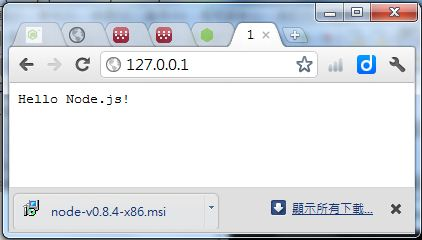
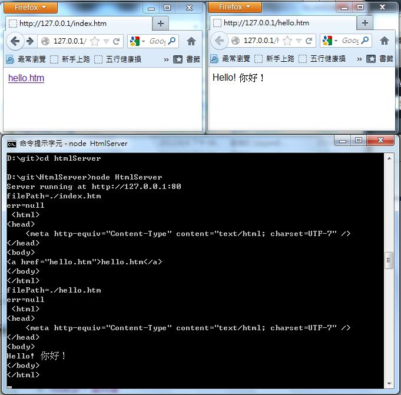

# Node.js -- Web 程式

## 第一個 Web 程式

程式：HelloWeb.js

```javascript
var http = require('http');
http.createServer(function (req, res) {
  res.writeHead(200, {'Content-Type': 'text/plain'});
  res.end('Hello Node.js!\n');
}).listen(80, '127.0.0.1');
console.log('Server running at http://127.0.0.1:80/');
```

執行結果

```
D:\ccc101\nodejs>node WebHello.js
Server running at http://127.0.0.1:80/
```



## HtmlServer

執行結果：




```javascript
var server,
    ip   = "127.0.0.1",
    port = 80,
    http = require('http'),
    fs = require("fs"),
    folderPath = ".",
    url = require('url'),
    path,
    filePath,
    encode = "utf8";

server = http.createServer(function (req, res) {
    path = url.parse(req.url);
    filePath = folderPath + path.pathname;
	console.log("filePath="+filePath);
    fs.readFile(filePath, encode, function(err, file) {
	  console.log("err="+err);
      if (err) {
          res.writeHead(404, {'Content-Type': 'text/plain'});
          res.end();
          return;
      }

      res.writeHead(200, {'Content-Type': 'text/html'});
      res.write(file);
	  console.log(file);
      res.end();
    });
});

server.listen(port, ip);

console.log("Server running at http://" + ip + ":" + port);
```

## 簡易 WebServer

由於 node.js 採用 Event Queue 的方式執行 (類似 Win3.1 中的協同式多工)，而沒有採用 Thread 的方式，因此對所有 輸出入 IO 都應該盡可能採用非同步的方式執行，這樣才能讓 node.js 程式發揮最大的效能，否則就會因為 IO 而卡住。

因此以下兩個版本當中，以非同步版速度較快。

### 簡易 WebServer ：同步版 (效能較差，不符合 node.js 的設計理念)


```javascript
var path = require('path');
var fs = require("fs");
var qs = require('querystring');
var express = require("express");
var app = express();    
app.listen(80);
 
var response = function(res, type, text) {
    res.writeHead(200, {'Content-Type': type});
    res.write(text);
    console.log(text);
    res.end();
}
 
app.get('*', function(req, res){
  try {
    var path = '.' + req.url;
    fs.stat(path, function(err, pathStat) {
        if (err) {
            response(res, "text/plain", err.toString());
            return;
        }
        if (pathStat.isFile()) {
            fs.readFile(path, "utf8", function(err, file) {
                response(res, "text/html", file);
            });
        } else if (pathStat.isDirectory()) {
            var dirPath = req.url;
            if (dirPath.substring(-1)!=="/") 
                dirPath = dirPath+"/";
            var html = "<html><body><h1>"+req.url+"</h1>\n";
            fs.readdir(path, function(err, files) {
                for (f in files) {
                    fname = files[f];
                    filePath = dirPath+fname;
                    html += "<li><a href='"+filePath+"'>"+fname+"</a></li>\n";
                }
                html += "<body></html>";
                response(res, "text/html", html);
            });
        } 
    });    
  } catch (err) {
    response(res, "text/plain", err.toString());
  }
});
 
console.log('start WebServer\n');
```

### 簡易 WebServer ：非同步版 (效能較好，符合 node.js 的設計理念)

```javascript

var path = require('path');
var fs = require("fs");
var qs = require('querystring');
var express = require("express");
var app = express();    
app.listen(80);
 
var response = function(res, type, text) {
    res.writeHead(200, {'Content-Type': type});
    res.write(text);
    console.log(text);
    res.end();
}
 
app.get('*', function(req, res){
  try {
    var path = '.' + req.url;
    fs.stat(path, function(err, pathStat) {
        if (pathStat.isFile()) {
            fs.readFile(path, "utf8", function(err, file) {
                response(res, "text/html", file);
            });
        } else if (pathStat.isDirectory()) {
            var html = "<html><body>";
            fs.readdir(path, function(err, files) {
                for (f in files) {
                    fname = files[f];
                    filePath = req.url+fname;
                    html += "<li><a href='"+filePath+"'>"
                             +filePath+"</a></li>\n";
                }
                html += "<body></html>";
                response(res, "text/html", html);
            });
        } 
    });    
  } catch (err) {
    response(res, "text/plain", err.toString());
  }
});
 
console.log('start WebServer\n');
```

## 較完整的 WebServer (非同步版)

程式：WebServer2.js

```javascript
var path = require('path');
var fs = require("fs");
var qs = require('querystring');
var express = require("express");
var app = express();

var mimeType = {
   "jpg":"image/jpeg", 
   "gif":"image/gif", 
   "png":"image/png", 
   "svg":"image/svg",
   "zip":"application/zip", 
   "pdf":"application/pdf", 
   "xls":"application/vnd.ms-excel", 
   "ppt":"application/vnd.ms-powerpoint", 
   "doc":"application/msword", 
   "htm":"text/html", 
   "html":"text/html"
};

function getMimeType(ext) {
	var type = mimeType[ext];
	if (!type)
		return "text/plain";
	else
		return type;
}

app.listen(80);

var response = function(res, type, data) {
	res.writeHead(200, {'Content-Type': type});
	if (type.indexOf("text/")>=0)
		res.end(data);
	else
		res.end(data, "binary");
}

app.get('*', function(req, res){
  try {
	var path = '.' + req.url;
	fs.stat(path, function(err, pathStat) {
		if (err) {
			response(res, "text/plain", err.toString());
			return;
		}
		if (pathStat.isFile()) {
			fs.readFile(path, function(err, file) {
				var tokens = path.split(".");
				var ext = tokens[tokens.length-1];
				response(res, getMimeType(ext), file);
			});
		} else if (pathStat.isDirectory()) {
			var dirPath = req.url;
			if (dirPath.substring(-1)!=="/") 
				dirPath = dirPath+"/";
			var html = "<html><body><h1>"+req.url+"</h1>\n";
			fs.readdir(path, function(err, files) {
				for (f in files) {
					fname = files[f];
					filePath = dirPath+fname;
					html += "<li><a href='"+filePath+"'>"+fname+"</a></li>\n";
				}
				html += "<body></html>";
				response(res, "text/html", html);
			});
		} 
	});	
  } catch (err) {
	response(res, "text/plain", err.toString());
  }
});

console.log('start WebServer\n');
```


## 參考文獻
* 深入浅出Node.js相关的内容 -- <http://www.infoq.com/cn/master-nodejs>
    * 深入浅出Node.js（一）：什么是Node.js -- http://www.infoq.com/cn/articles/what-is-nodejs
    * 深入浅出Node.js（三）：深入Node.js的模块机制 -- http://www.infoq.com/cn/articles/nodejs-module-mechanism
