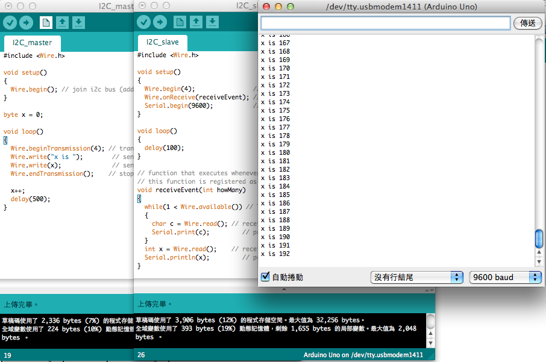

# 有線通訊 - 使用 I2C 送訊息

參考：http://arduino.cc/en/Tutorial/MasterWriter


## 執行結果




## 程式

檔案：

```CPP
#include <Wire.h>

void setup()
{
  Wire.begin(); // join i2c bus (address optional for master)
}

byte x = 0;

void loop()
{
  Wire.beginTransmission(4); // transmit to device #4
  Wire.write("x is ");        // sends five bytes
  Wire.write(x);              // sends one byte  
  Wire.endTransmission();    // stop transmitting

  x++;
  delay(500);
}
```

檔案：

```CPP

#include <Wire.h>

void setup()
{
  Wire.begin(4);                // join i2c bus with address #4
  Wire.onReceive(receiveEvent); // register event
  Serial.begin(9600);           // start serial for output
}

void loop()
{
  delay(100);
}

// function that executes whenever data is received from master
// this function is registered as an event, see setup()
void receiveEvent(int howMany)
{
  while(1 < Wire.available()) // loop through all but the last
  {
    char c = Wire.read(); // receive byte as a character
    Serial.print(c);         // print the character
  }
  int x = Wire.read();    // receive byte as an integer
  Serial.println(x);         // print the integer
}
```
