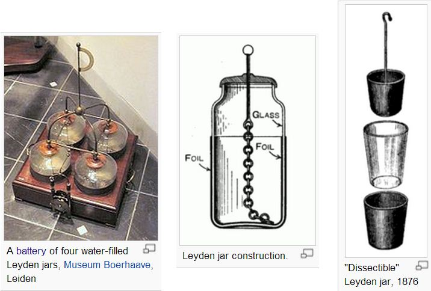
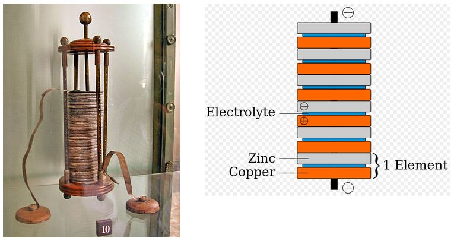
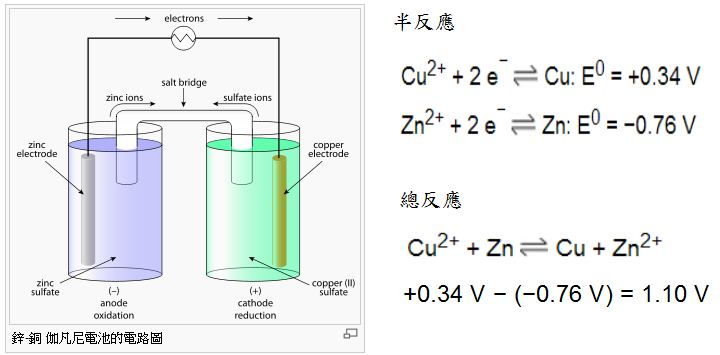
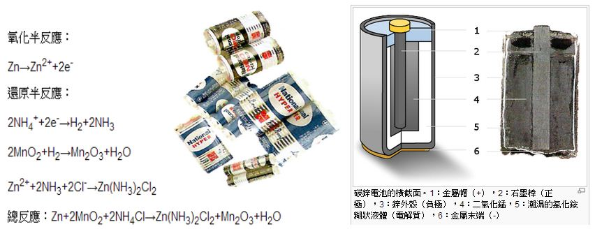
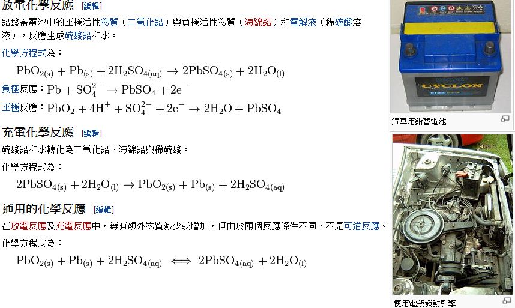
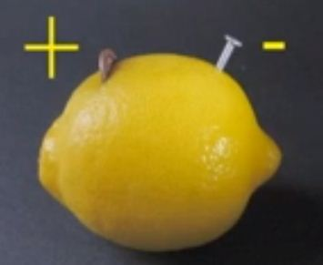

## 電池的歷史與原理

電池，一般狹義上的定義是將本身儲存的化學能轉成電能的裝置，廣義的定義為將預先儲存起的能量轉化為可供外用電能的裝置。因此，像太陽能電池只有轉化而無儲存功能的裝置不算是電池。其他名稱有電瓶、電芯，而中文池及瓶也有儲存作用之意。

### 萊頓瓶

萊頓瓶（英語：Leyden jar）是一種用以儲存靜電的裝置，最先由 Pieter van Musschenbroek（1692年－1761年）在荷蘭的萊頓試用。
作為原始形式的電容器，萊頓瓶曾被用來作為電學實驗的供電來源，也是電學研究的重大基礎。萊頓瓶的發明，標誌著對電的本質和特性進行研究的開始。

典型的萊頓瓶是一個玻璃容器，內外包覆著導電金屬箔作為極板。瓶口上端接一個球形電極，下端利用導體（通常是金屬鎖鏈）與內側金屬箔連接。萊頓瓶的充電方式是將電極接上靜電產生器等來源，外部金屬箔接地；內部與外部的金屬將會攜帶相等但極性相反的電荷。

嚴格來說，萊頓瓶並不屬於電池，而是一種電容，但早期還沒有電池的時候，常被事先充好電之後，拿來當一次性的放電體使用，所以可以說是最早的「電池」。

以下有個關於萊頓瓶如何被用在早期電學實驗上的故事，相信大家會有興趣，故事如下：

Jean-Antoine Nollet 是一個對電學特別有興趣的法國神父，1746 年時、他想要測試電流到底跑得多快，所以請兩百位修道士每個人手池金屬條
連接成總長一英哩 (1.6 公里) 的環狀迴路，然後他手持一只特大的萊頓瓶，連接上兩端的電極，結果這些修道士幾乎同時因被電極而癱軟在地。

後來他還想再做這類的實驗，但是修道士們都避之唯恐不及，拒絕再當一次實驗品，後來他只好去找法皇路易十五，讓皇帝命令一百八十名御林軍在凡爾賽宮當實驗品。

在萊頓瓶剛發明不久的那個年代，很多王公貴族對這些新奇的小玩意都很有興趣，甚這後來在酒吧裏，還流行用小的萊頓瓶去「電吻」，
也就是「觸碰一下萊頓瓶、感受被電到的感覺」。

### 伏打電堆與伽伐尼電池

在1780年，路易吉·伽伐尼 (義大利文：Luigi Galvani) 發現，兩種不同的金屬（例如，銅和鋅）連接後，如果同一時間觸摸青蛙腿的兩處神經，青蛙腿會發生收縮。
他稱這是「動物電」（animal electricity）。

伏打電堆（Voltaic pile），又名伏打堆，是最早出現的化學電池，是在1800年由義大利物理學家亞歷山卓·伏打伯爵發明。

伏打電堆由很多個單元堆積而成，每一單元有鋅板與銅板各一，其中夾著浸有鹽水的布或紙板以作為電解質。如下所示：

後來、這類由兩種不同的金屬與一種電解質組成的電池，通常被稱為「伽伐尼電池」，其結構通常改由兩個半電池間以鹽橋或多孔物相連而成。
其電路與反應式如下：

### 碳鋅電池

碳鋅電池 (zinc–carbon battery) 的容器是一個鋅罐。裡面有一層由 NH4Cl 和 ZnCl2 所構成的糊狀液體，
這個糊狀液體通過一個紙層與粉末狀的碳和二氧化錳隔開。這些粉末填充在一個碳棒的周圍。

此電池正極的碳棒與二氧化錳中所混合的碳只負責引出電流，並不參與反應，正極實際參與還原反應並提供
正電的是二氧化錳，因此，又稱為錳鋅電池、鋅錳電池或鋅－二氧化錳電池，也有簡稱錳乾電池的。

碳鋅電池的電動勢大約是1.5V。電動勢的不確定是由於陰極反應十分複雜，相比來說，陽極反應（鋅端）則有一個已知的電勢。
副反應及活性反應物的消耗直接導致電池的內阻增加，電池電動勢降低。

### 鉛酸蓄電池

蓄電池的原理是通過將化學能和直流電能相互轉化，在放電後經充電後能復原，從而達到重複使用效果。

鉛酸蓄電池  (Lead–acid battery) 的氧化還原總反應電壓為 2 V (伏特) ，所以一顆由 K 的電磁單元所組成的
鉛蓄電池之電壓通常為 2K 伏特。

### 電池 DIY : 檸檬電池

看了以上這麼多電池，雖然感覺原理並不難，但是要自己動手做一顆，卻還是不知如何下手。

不過還好、我們可以用檸檬！

YouTube 上已經有人做了詳細的示範，告訴我們「如何用檸檬做出電池」，請參考以下影片：

* Create a Lemon Battery -- <http://youtu.be/AY9qcDCFeVI>

所以、我們應該也可以用「50 元或  1 元的銅板」，加上鐵釘去做出檸檬電池，其中銅板是正極，而鐵釘因為表面通常會
鍍鋅以防止生鏽，再加上檸檬所含的電解質可以扮演鹽橋的功能，所以就可以組合成標準的「銅-鋅、伽凡尼」電池。

「銅-鋅反應」釋放的電壓大約是 1.1 伏特，而點亮一顆 LED 需要 3 伏特以上的電壓，所以必須要用三顆以上的檸檬電池
串連，就可以點亮 LED 燈了。

### 結語

電池通常是由「化學反應」所供電的，而這些化學反應釋放的電壓經常是固定的，假如該電池的化學反應釋放的電壓是 n 
伏特，那麼這類電池所釋放的電壓通常是 n*k 伏特，因為一顆電池通常是由 k 個電池單元 (Battery Cell) 所組成的。

### 參考文獻
* 維基百科：[電池](http://zh.wikipedia.org/wiki/%E7%94%B5%E6%B1%A0)
* 維基百科：[伽凡尼電池](http://zh.wikipedia.org/wiki/%E4%BC%BD%E5%87%A1%E5%B0%BC%E9%9B%BB%E6%B1%A0)
* 維基百科：[伏打電堆](http://zh.wikipedia.org/wiki/%E4%BC%8F%E6%89%93%E7%94%B5%E5%A0%86)
* 維基百科：[鉛酸蓄電池](http://zh.wikipedia.org/wiki/%E9%89%9B%E9%85%B8%E9%9B%BB%E6%B1%A0)
* 維基百科：[碳鋅電池](http://zh.wikipedia.org/wiki/%E9%8B%85%E9%8C%B3%E9%9B%BB%E6%B1%A0)
* <http://en.wikipedia.org/wiki/Battery_(electricity)>
* [檸檬電池如何讓燈泡發亮？](http://jeanniepix.pixnet.net/blog/post/116589175-%E6%AA%B8%E6%AA%AC%E9%9B%BB%E6%B1%A0%E5%A6%82%E4%BD%95%E8%AE%93%E7%87%88%E6%B3%A1%E7%99%BC%E4%BA%AE%EF%BC%9F)

【本文由陳鍾誠取材並修改自 [維基百科] 與 OpenStax College 的 [College Physics] 一書，採用創作共用的 [姓名標示、相同方式分享] 授權】

