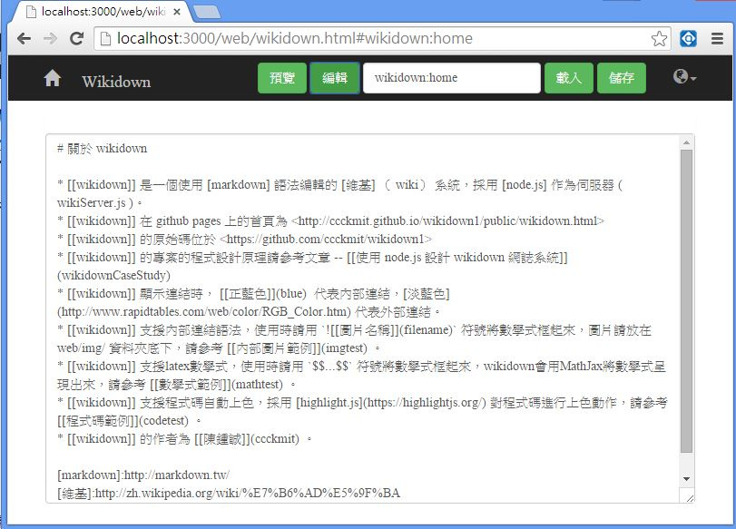
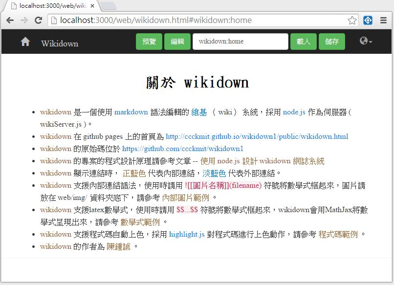
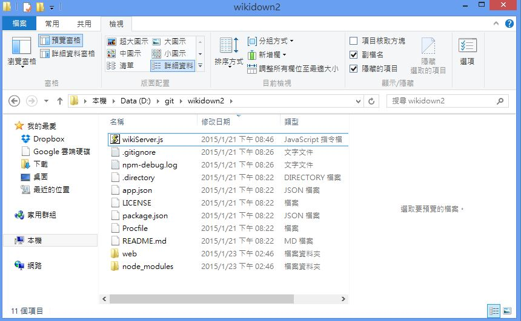
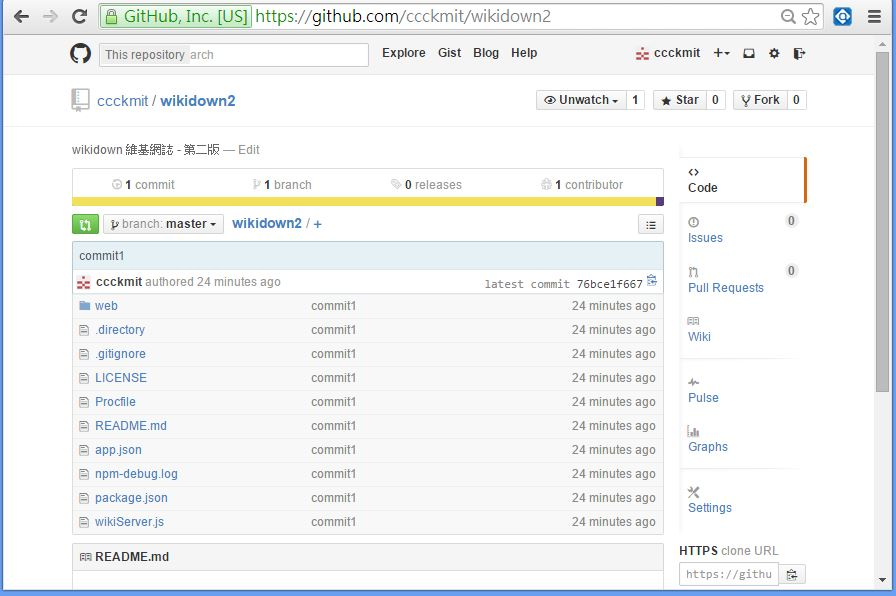

% [程式人雜誌](http://programmermagazine.github.com/home/)
% 2015 年 3 月
% 本期焦點：Wikidown.js 維基網誌系統 -- 躍上雲端記

# 前言
## 編輯小語

繼 [上期](http://programmermagazine.github.io/201501/htm/home.html) 探討了 javascript 前端技術之後，本期我們將焦點放在筆者開發的一個維基型網誌專案 [wikidown.js] 上，用實際的案例探討如何將前後端結合在一起的方法。

在 [wikidown.js] 專案中，我們採用了前端的 HTML/CSS/JavaScript 等必要技術，然後用 [bootstrap] 作為介面以便支持手機類的行動裝置，並用了 [showdown.js] 這個開放原始碼專案進行 markdown 文件轉為 HTML 的動作，最後再加上 [highlight.js] 為程式碼區塊加上顏色，還有用 [MathJax] 顯示latex 數學式的功能。

而在  [wikidown.js] 的後端伺服器部份，則是非常輕量級的，因為我們將所有程式盡可能放在前端，所以後端就只剩下了檔案的讀寫動作。

後端部份採用 [node.js] 作為伺服平台，然後用 [express.js] 套件作路徑 (routing) 的比對處理並輸出靜態網站，接著用 [serve-index.js] 套件提供靜態檔案瀏覽功能，於是 [wikidown.js] 就完成了。

雖然 [wikidown.js] 看來用到了很多套件，但是事實上整個專案的程式碼非常小，主要包含 [wikidown.html] 共 200 行，還有 [wikiServer.js] 共 60 行，可以說是一個超小型專案，但是『麻雀雖小、卻是五臟俱全』阿！

寫了 [wikidown.js] 維基網誌系統後，我深深地體會到，現在的程式設計是很難獨立建構出整個系統的，我們只有站在開放原始碼的肩膀上，才能做得更快又更好。

就像牛頓的那句名言：『只有站在巨人的肩膀上、我們才能看得更高更遠』，對於程式人而言，那個巨人就是 [開放原始碼] ，我們只有站在 [開放原始碼] 的基礎上，才能做得又快又好阿！

---- （「程式人雜誌」編輯 - 陳鍾誠）

[wikidown.js]:wikidown:home
[highlight.js]:https://highlightjs.org/
[bootstrap]:http://getbootstrap.com/
[showdown.js]:https://github.com/showdownjs/showdown
[MathJax]:http://www.mathjax.org/
[node.js]:http://nodejs.org/
[express.js]:http://expressjs.com/
[wikidown.html]:https://github.com/ccckmit/wikidown.js/blob/master/web/wikidown.html
[wikiServer.js]:https://github.com/ccckmit/wikidown.js/blob/master/wikiServer.js
[開放原始碼]:http://zh.wikipedia.org/zh-tw/%E5%BC%80%E6%94%BE%E6%BA%90%E4%BB%A3%E7%A0%81


## 授權聲明

本雜誌許多資料修改自維基百科，採用 創作共用：[姓名標示、相同方式分享] 授權，若您想要修改本書產生衍生著作時，至少應該遵守下列授權條件：

1. 標示原作者姓名 (包含該文章作者，若有來自維基百科的部份也請一併標示)。
3. 採用 創作共用：[姓名標示、相同方式分享] 的方式公開衍生著作。

另外、當本雜誌中有文章或素材並非採用 [姓名標示、相同方式分享] 時，將會在該文章或素材後面標示其授權，此時該文章將以該標示的方式授權釋出，請修改者注意這些授權標示，以避免產生侵權糾紛。

例如有些文章可能不希望被作為「商業性使用」，此時就可能會採用創作共用：[姓名標示、非商業性、相同方式分享] 的授權，此時您就不應當將該文章用於商業用途上。

最後、懇請勿移除公益捐贈的相關描述，以便讓愛心得以持續散播！


# 本期焦點
## Wikidown 的語法與使用方式

Wikidown 是一個結合 wiki 與 markdown 兩種概念的系統，利用類似維基百科的  wiki 組織功能，但是卻將 wiki 語法改為 markdown 語言來撰寫，這兩個概念的結合形成了 wikidown 系統的骨幹。

您可以從下列的 wikidown 編輯畫面看出編輯框中採用的是 markdown 的語法，markdown 語法的特色是，就算在原始碼階段也很容易看清楚呈現後的樣子，因為 markdown 的設計哲學就是讓文字檔也有「所視即所得」的感覺，因此也非常容易記憶、撰寫和感受。



如果您按下預覽按鈕，上圖的編輯內容就會被 wikidown 轉換成 HTML 後顯示出來，您可以看到那些簡易的 markdown 文字內容被轉換成『具有超連結與排版的 HTML網頁，如下圖所示：



除了一般性的網頁排版、圖片之外，wikidown 也支援了一些在 markdown 標準規格上未定義，但是卻常被用來延伸 markdown 功能的語法，像是表格與數學式等等。

舉例而言、本期的雜誌我們就是採用 wikidown 編輯的，以下就是這些 markdown 延伸語法的一些範例

### 內部連結

在 markdown 中的連結語法為 `[顯示文字](url)` ，因此若您想引用像 yahoo 這樣一個外部連結，就可以用 `[Yahoo](http://www.yahoo.com/)` ，但是如果您想引用內部的連結，則可以採用相對路徑的方式，例如：`[說明](help.html)` 這樣的語法就可以引用同一層次的網頁。

但是在 wikidown 系統中，所有的 markdown 檔案都被直接以文字檔的方式儲存在 `web/db/<domain>/<file>` 這樣的路徑下，直接引用這些檔案的話，所呈現的將會是 markdown 語法的文字檔，而無法以網頁的方式呈現。

若要以網頁的方式呈現，必須透過 `wikidown.html#<domain>:<file>` 或 `#<domain>:<file>` 這樣的網址去顯示，所以我們可以用 `[程式人雜誌2015年3月號](#pmag201503:home)` 來連結到本期雜誌的首頁。

但是這種方法還是要加上 `<domain>` 欄位 ，還不夠方便，於是我們設計了一種擴充性的語法，其中  `[[顯示文字]](file)` 直接用來連結內部的 markdown 檔案，所以如果您正在編輯 `pmag201503:focus1` 這個檔案，就可以用 `[[程式人雜誌2015年3月號]](home)` 的語法連結到該同一 `<domain>` 的 home 檔案，而不需要明確的指定 `<domain>` 了，這種語法稱為內部連結。

您除了可以用 `[[顯示文字]](file)` 這樣的語法引用同一 domain 的連結之外，也可以用 `[[file]]` 這樣更精簡的語法直接引用，或者用 `[[顯示文字]](domain:file)` 與 `[[domain:file]]` 這樣的語法引用其他 domain 的連結。

### 表格語法


呈現結果如下

----

[程式人雜誌](../pmag/home.html)

| 出刊年月 | 焦點主題 |
|------|------|
| [2015年1月號](home.html) |  [wikidown.js](https://github.com/ccckmit/wikidown.js) 維基網誌系統 -- 躍上雲端記  |

----

### 數學式

接著來看看數學式的範例，如果我們輸入下列  latex 語法

`$\int_{0}^{\infty} f(x)$` 

那麼 wikidown 會呼叫 MathJax 這個開源 javascript 套件將數學式轉換為下列呈現結果。

$\int_{0}^{\infty} f(x)$

### 內部圖片

內部圖片的語法為 `![[圖片說明]](filename)` ，例如在 `pmag201503:focus1` 這個檔案內編輯輸入  `![[姓名標示、相同方式分享]](cc_by_sa.jpg)` 的語法，該語法會被 wikidown 轉換為下列的 HTML 語法。

```
<div class="figure">
  
  <p class="caption">姓名標示、相同方式分享</p>
</div>
```

於是您只要將圖片放在對應的 img 資料夾底下，就能正確的顯示這些圖片了，以下是上述 `![[姓名標示、相同方式分享]](cc_by_sa.jpg)` 的顯示結果。


以下是筆者將 wikidown.js 系統安裝在自己的電腦中使用的教學錄影，對於想安裝這個系統使用的人而言，應該會很有幫助。

* [YouTube影片：wikidown.js = wiki + markdown + node.js -- 安裝與使用](http://youtu.be/TCd8OTGbwmc)


### 結語

透過這樣的延伸語法， wikidown 彌補了 markdown 被用在維基系統上的一些不足之處，於是我們站在 markdown 的基礎上，建立的 wikidown.js  這樣一個支援 markdown 擴充語法的維基型網誌系統。

而您現在所看到位於 的網頁，很可能就是我們用 wikidown 所編輯的版本，並且正透過 wikidown 系統誠現在您的面前阿！


## Wikidown 的原始碼解析

wikidown 的原始碼主要包含兩個檔案，一個是前端的 wikidown.html ，另一個是後端的 wikiServer.js 。

前端的 wikidown.html 負責建構使用者介面，並透過 jQuery 的 ajax 遠端呼叫載入或儲存您編輯的 markdown 檔案，而後端的 wikiServer.js 則單純負責 markdown 檔案的讀取與寫入動作，並傳回讀取的內容給前端的 wikidown.html。

以下就讓我們來看看 wikidown 前後兩端程式的原始碼吧！

### 前端網頁：wikidown.html

```
<html>
<head>
<meta charset="utf-8" />
  <link rel="icon" href="favicon.ico">
  <link href="css/bootstrap.min.css" rel="stylesheet">
  <link rel="stylesheet" href="css/highlight.default.min.css">
  <link href="main.css" rel="stylesheet">
</head>
<body onload="init()">
    <nav class="navbar navbar-inverse navbar-fixed-top">
      <div class="container">
        <button type="button" class="navbar-toggle collapsed" data-toggle="collapse" data-target="#navbar" aria-expanded="false" aria-controls="navbar">
          <span class="sr-only">Toggle navigation</span>
          <span class="icon-bar"></span>
          <span class="icon-bar"></span>
          <span class="icon-bar"></span>
        </button>
        <div class="navbar-header">
          <a class="navbar-brand" href="#main:home" style="color:#C0C0C0">
		    <span class="glyphicon glyphicon-home"></span> &nbsp;
	      </a>
          <a id="titlelink" class="navbar-brand" href="#wikidown:home" style="color:#C0C0C0">
			<span id="title">Wikidown</span> 
	      </a>
        </div>
        <div id="navbar" class="navbar-collapse collapse">
          <form class="navbar-form navbar-right">
            <div class="form-group">
	      <button class="btn btn-success" type="button" onclick="show()">預覽</button>
              <button class="btn btn-success" type="button" onclick="edit()">編輯</button>
              <input id="filepath" type="text" class="form-control" placeholder="filepath" aria-describedby="basic-addon1" value="main:home">
	      <button class="btn btn-success" type="button" onclick="load()">載入</button>
              <button class="btn btn-success" type="button" onclick="saveFile()">儲存</button>
			</div>
          </form>
        </div>
      </div>
    </nav>

    <div id="showPanel" class="tab-pane panel">
      <div id="htmlBox" class="container"></div>
    </div>
    <center>
      <div id="editPanel" class="tab-pane panel" style="width:90%; height:90%;">
        <br/>
        <textarea id="mdBox" class="form-control" style="width:100%; height:100%"></textarea>
      </div>
    </center>

    <script src="js/jquery.min.js"></script>
    <script src="js/bootstrap.min.js"></script>
    <script src="js/Showdown/Showdown.min.js"></script>
    <script src="js/Showdown/extensions/table.min.js"></script>
    <script src="js/highlight.min.js"></script>
    <script src="config.js"></script>
	<script src="http://cdn.mathjax.org/mathjax/latest/MathJax.js?config=TeX-AMS-MML_SVG"></script>
<script>
function path() {
  var tokens = filepath.split(':');
  return { domain:tokens[0], file:tokens[1] };
}

DB = {};

DB.save=function(domain, file, doc) {
  $.ajax({
    type: "POST",
    url: "/db/"+domain+"/"+file,
	timeout:2000,
    data: { obj: doc },
  })
  .done(function(data) {
    alert( "存檔完成!");
  })
  .fail(function() {
    alert( "存檔失敗！" );
  });
}

DB.load=function(domain, file) {
  return $.ajax({
    type: "GET",
    url: "./db/"+domain+"/md/"+file,
	timeout:2000,
    data: {}
  });
}

var filepath, converter;

function init() {
  converter = new Showdown.converter({ extensions: ['table'] });
  if (window.location.hash === '')
    filepath = $('#filepath').val();
  else
    filepath = window.location.hash.substring(1);

  $('#filepath').keypress(function(e) {
  if (e.which == '13') {
     e.preventDefault();
     filepath = $('#filepath').val();
     loadFile(filepath);
   }
  });
  loadFile(filepath);
}

function switchPanel(name) {
  $('.panel').css( "display", "none");
  $('#'+name).css( "display", "block");
}

function mdToHtml(md) {
  md  = "\n"+md+"\n"+config.append+"\n"; 
  md  = md.replace(/(\s)\!\[\[([^\]]*?)\]\]\((.*?)\)/gi, '$1<div class="figure"><p class="caption">$2</p></div>'); // 內部圖片 
  md  = md.replace(/(\s)\[\[([^\]]+?)\]\]\(([^:\)]+):([^:\)]+)\)/gi, '$1<a href="#$3:$4" class="innerLink">$2</a>'); // 內部連結 [text](file.html)
  md  = md.replace(/(\s)\[\[([^\]]+?)\]\]\((.*?)\)/gi, '$1<a href="#'+path().domain+':$3" class="innerLink">$2</a>'); // 內部連結 [text](file.html)
  md  = md.replace(/(\s)\[\[([^\]:]+):([^\]:]+)\]\]/gi, '$1<a href="#$2:$3" class="innerLink">$2:$3</a>'); // 內部連結 [file](file.html)
  md  = md.replace(/(\s)\[\[([^\]:]+?)\]\]/gi, '$1<a href="#'+path().domain+':$2" class="innerLink">$2</a>'); // 內部連結 [file](file.html)
  md  = md.replace(/(\s)\$\$([^$]+?)\$\$/gi, '$1<script type="math/tex">$2</'+'script>');// 數學式 
  return converter.makeHtml(md);
}

var mdNewFile = '# 標題：文件不存在\n\n您可以編輯後存檔！\n## 語法\n* [內部連結](innerLink.html)\n* [外部連結](link)';

function edit() {
  switchPanel('editPanel');
}

function show() {
  var md = $('#mdBox').val();
  var html = mdToHtml(md);
  $('#htmlBox').html(html);
  $('pre code').each(function(i, block) {
    hljs.highlightBlock(block);
  });
  switchPanel('showPanel');
  MathJax.Hub.Queue(["Typeset",MathJax.Hub, "htmlBox"]);
}

function load() {
  filepath = $('#filepath').val();
  loadFile(filepath);
}

function loadFile(filepath) {
  if (filepath === null || filepath === '')
    return;
  $('#filepath').val(filepath);
  var domain = path().domain;
  window.location.hash = '#'+filepath;
  DB.load(path().domain, path().file)
  .done(function(md) {
    $('#mdBox').val(md);
    show();
  })
  .fail(function() {
    $('#mdBox').val(mdNewFile);
    show();
  });
}

function saveFile() {
  var md = $('#mdBox').val();
  DB.save(path().domain, path().file, md);
}

window.onhashchange = function () {
  filepath = window.location.hash.substring(1);
  loadFile(filepath);
}

window.onbeforeunload = function(){}
</script>
</body>
</html>
```

### 後端伺服器：wikiServer.js

```javascript

var c = console;
var fs = require('fs');
var express = require('express');
var path = require('path');
var bodyParser = require("body-parser"); // 參考：http://codeforgeek.com/2014/09/handle-get-post-request-express-4/
var cookieParser = require('cookie-parser')
var session = require('express-session');
var serveIndex = require('serve-index');

var app = express();
var webDir = path.join(__dirname, 'web');
var dbRoot = path.join(webDir, 'db');

app.use(cookieParser());
app.use(session({secret: '@#$TYHaadfa1', resave: false, saveUninitialized: true}));
app.use(bodyParser.urlencoded({ extended: false }));
app.use('/web/', express.static(webDir));
app.use('/web/', serveIndex(webDir, {'icons': true}));

function response(res, code, msg) {
  res.set('Content-Length', ''+msg.length).set('Content-Type', 'text/plain').status(code).send(msg).end();
  c.log("response: code="+code+"\n");
}

app.get("/", function(req, res) {
  res.redirect('/web/wikidown.html');
});

app.post("/db/:db/:name", function(req, res) {
  var db = req.params.db;
  var name = req.params.name;
  var obj = req.body.obj;
  var msg = "db:"+db+" name:"+name+"\n"+obj;
  c.log(msg);
  fs.writeFile(dbRoot+"/"+db+"/md/"+name, obj, function(err) {
    if (err)
      response(res, 500, 'write fail!');
    else
      response(res, 200, 'write success!');
  })
});

var port = process.env.PORT || 3000; // process.env.PORT for Heroku
app.listen(port);

console.log('Server started: http://localhost:'+port);

```

### 結語

以上的 wikidown 系統設計方式，盡可能的將功能放在前端的單一網頁上，而後端則只是用來『儲存或取出資料』而已，筆者覺得這種方法非常的簡潔，不需要像很多 node.js 系統採用了很多 jade, ejs 等樣板所建構的網頁，將功能重點放在後端，然後不停的轉換頁，讓系統變得較為複雜且龐大。

當然、有一得必有一失，將前端功能全放在單一網頁中，就比較難以分工進行，因此在團隊合作上會比較困難。

不過、對於筆者這樣一個人包辦整個系統的『獨立開發者』而言，這種方式似乎是比較方便且敏捷的阿！


## 將 Wikidown 推上 github 成為開源靜態網站

雖然 github 是開放原始碼的人用  git 版本管理系統發布專案的地方，但是卻也提供了 Github-Pages (gh-pages) 這一個版本可以讓人架設網站，在本文中，我們透過 wikidown 示範如何將專案發布到 github 上，並且架設成靜態網站的方法。

雖然 wikidown 已經存在於 <https://github.com/ccckmit/wikidown.js> 這個網址上了，但是為了要重新示範一次，我們將創建一個新的專案，稱為 wikidown2 ，其網址將會位於 <https://github.com/ccckmit/wikidown2> 當中。

首先讓我們檢視一下專案的內容，以下是我們用檔案管理員檢視尚未進行 git 初始化前的 wikidown 資料夾內容，您可以看到裡面只有專案的檔案與資料夾。



```
user@ASUS /d/git
$ cd wikidown2

user@ASUS /d/git/wikidown2
$ ls
LICENSE   README.md  node_modules   package.json  wikiServer.js
Procfile  app.json   npm-debug.log  web

user@ASUS /d/git/wikidown2
$ git init
Initialized empty Git repository in d:/git/wikidown2/.git/

user@ASUS /d/git/wikidown2 (master)
$ git add -A
warning: LF will be replaced by CRLF in web/db/pmag201503/md/focus3.
The file will have its original line endings in your working directory.
warning: LF will be replaced by CRLF in web/js/highlight.min.js.
The file will have its original line endings in your working directory.

user@ASUS /d/git/wikidown2 (master)
$ git commit -am "commit1"
[master (root-commit) 76bce1f] commit1
warning: LF will be replaced by CRLF in web/db/pmag201503/md/focus3.
The file will have its original line endings in your working directory.
warning: LF will be replaced by CRLF in web/js/highlight.min.js.
The file will have its original line endings in your working directory.
 117 files changed, 65987 insertions(+)
 create mode 100644 .directory
 create mode 100644 .gitignore
 create mode 100644 LICENSE
 create mode 100644 Procfile
 create mode 100644 README.md
 create mode 100644 app.json
 create mode 100644 npm-debug.log
 create mode 100644 package.json
 create mode 100644 web/config.js
 create mode 100644 web/css/bootstrap-theme.css
 create mode 100644 web/css/bootstrap-theme.css.map
....
 create mode 100644 web/wikidown.html
 create mode 100644 web/wikidown1.html
 create mode 100644 wikiServer.js

user@ASUS /d/git/wikidown2 (master)
$ git remote add origin https://github.com/ccckmit/wikidown2.git

user@ASUS /d/git/wikidown2 (master)
$ git status
On branch master
nothing to commit, working directory clean
```

到目前為止，這些 git 指令的動作都還是在本地端執行的，所以即使不連上網路也是可以正常執行。

但是接下來的動作，就要開始上傳了，所以我們要先進入 github 帳號創建出  wikidown2 這個專案，方法是在 github 網站右上角的 + 號上按一下，然後在網頁中填入下列訊息。


接著在按下 create repository 這個按鈕後，該專案就建立了。然後我們就可以透過下列的 git push origin master 指令將 master 專案版本上傳到 github 上。

```
user@ASUS /d/git/wikidown2 (master)
$ git push origin master
Username for 'https://github.com': ccckmit
Password for 'https://ccckmit@github.com':
Counting objects: 97, done.
Delta compression using up to 4 threads.
Compressing objects: 100% (89/89), done.
Writing objects: 100% (97/97), 1.10 MiB | 119.00 KiB/s, done.
Total 97 (delta 10), reused 0 (delta 0)
To https://github.com/ccckmit/wikidown2.git
 * [new branch]      master -> master
```



對於一般性的專案而言，這樣就已經完成了 github 專案的上傳動作了。

不過如果要將 github 當作靜態網站使用，那麼就還繼續要創建一個 gh-pages 的版本上傳上去，因為 git hub 規定只有在 gh-pages 這個分枝版本的內容，才能夠在不出現 github 管理功能的畫面下以靜態網站的方式呈現。

因此、我們必須用 git checkout gh-pages 這個指令，將專案分枝到 gh-pages 這個版本，然後再用 git push origin gh-pages 這個指令將 gh-pages 版本推到位於 origin 指定位址的 github 專案當中，這樣才算完整的發布專案與靜態網站。

```
user@ASUS /d/git/wikidown2 (master)
$ git branch gh-pages

user@ASUS /d/git/wikidown2 (master)
$ git status
On branch master
nothing to commit, working directory clean

user@ASUS /d/git/wikidown2 (master)
$ git checkout gh-pages
Switched to branch 'gh-pages'

user@ASUS /d/git/wikidown2 (gh-pages)
$ git merge master
Already up-to-date.

$ git push origin gh-pages
Username for 'https://github.com': ccckmit
Password for 'https://ccckmit@github.com':
Total 0 (delta 0), reused 0 (delta 0)
To https://github.com/ccckmit/wikidown2.git
 * [new branch]      gh-pages -> gh-pages
```

如此、就大功告成了，您可以在下列網址看到剛剛上傳靜態網站的 wikidown.html 網頁，並且透過 wikidown 系統瀏覽我們已經上傳的那些 markdown 文件，把 github 當成維基網誌系統來用了。

* <http://ccckmit.github.io/wikidown2/web/wikidown.html>

以下是我們輸入上述網址後所看到的畫面：


這樣，我們除了可以將專案上傳到 github 分享給開放原始碼社群之外，也可以透過 github 創建靜態網站，把 wikidown 當成維基網誌系統來用，可以說是一舉數得阿！

### 後記

以下是筆者將 wikidown.js 系統上傳到 github 成為靜態網站的教學錄影，對於想瞭解 github 上傳過程的人而言，應該會很有幫助。

* [YouTube影片：如何使用 git 與 github 建立開放原始碼專案與網站 -- 以 wikidown.js 為例 ]( http://youtu.be/ZzCDx28-P9Y)


## 將 Wikidown 推上 heroku 成為雲端系統

如果您已經有個專案，並且將檔案都加入 git  裡面了，就像下列文章中所做的事情一樣，那麼恭喜您，您已經具備了將檔案上傳到 heroku 上的大部分基礎，只要在補上幾個動作就行了。

* [將 Wikidown 推上 github 成為開源靜態網站](../pmag201503/focus3.html)

### 申請帳號並安裝軟體

要將您的 node.js 系統「安裝」到 heroku 平台上，必須依靠 git 工具，還有一個 heroku 所出版的軟體，稱為 Heroku Toolbelt for Windows ，您可以到下列網址中下載這個軟體。

* <https://devcenter.heroku.com/articles/getting-started-with-nodejs#set-up>

安裝好之後，您必須上 heroku 網站 <https://www.heroku.com/> 上申請帳號密碼，然後用 `heroku create <project>` 這個指令在 heroku 上創建一個專案，接著用 `git push heroku master` 將您的 master 版本推到 heroku 上，然後用 `heroku open` 指令打開該專案的網址，就可以看到您的專案已經在 heroku 上面運行了。

```
heroku create wikidown
git push heroku master
heroku open
```

當然、這是在您的專案與程式完全正確的情況之下才行的，不過、到底要上傳到 heroku 上的專案要如何才算是正確的呢？除了您可以用 node.js 將該專案跑起來之外，還必須加上一些設定。

第一個設定是您必須在專案的根目錄中加入一個名為 Procfile 的檔案，這個檔案用來告訴 heroku 執行您專案的指令。

檔案：Procfile

```
web: node wikiServer.js
```

還有您必須要寫好 node.js 需要的 package.json 檔案，以下是 wikidown 的 package.json 檔案之內容，這樣 heroku 才知道要為你準備好哪些版本的套件。

檔案： package.json

```javascript
{
  "name": "wikidown",
  "version": "1.0.0",
  "description": "Wikidown = wiki+markdown",
  "main": "wikiServer.js",
  "dependencies": {
    "serve-index": "~1.6.0",
    "body-parser": "^1.10.1",
    "cookie-parser": "1.3.3",
    "express-session":"1.10.1",
    "express": "4.11.0"
  },
  "devDependencies": {},
  "scripts": {
    "test": "echo \"Error: no test specified\" && exit 1",
    "start": "node wikiServer.js"
  },
  "repository": {
    "type": "git",
    "url": "https://github.com/ccckmit/markdown1.git"
  },
  "keywords": [
    "wiki",
    "markdown",
    "blog"
  ],
  "author": "ccckmit",
  "bugs": {
    "url": "https://github.com/ccckmit/markdown1/issues"
  },
  "homepage": "https://github.com/ccckmit/wikidown1"
}
```

還有很重要的一點是，您的 node.js 伺服端程式，必須使用 process.env.PORT 這個環境變數來開 port ，否則將會因為開錯 port 而無法運作。以下是 wikidown 專案打開 port 部份的程式碼：

```javascript
var port = process.env.PORT || 3000; // process.env.PORT for Heroku
app.listen(port);
```

如果您想在上傳之前先驗證您的系統是否能在 heroku 上正常運行，可以用 `foreman start` 這個指令進行測試，該指令會模擬 heroku 的環境來執行您的專案。執行完該指令後請開啟 `http://localhost:5000` 這個 網址來檢視您的系統。

如果一切沒問題，就可以按照本文一開頭的指示，用下列指令將系統上傳到 heroku 上運行。

```
heroku create wikidown
git push heroku master
heroku open
```

假如還是有問題的話，建議您參考 heroku 網站上針對 node.js 寫的 [getting-started-with-nodejs](https://devcenter.heroku.com/articles/getting-started-with-nodejs) 這篇文章，並且一步一步的照做一遍，應該就會瞭解如何將專案放上 heroku 平台的方法了。

### 後記

以下是筆者將 wikidown.js 系統上傳到 heroku 上的教學錄影，對於想發布專案到 heroku 上的人而言，應該會很有參考價值。

* [YouTube影片：如何將 node.js 的網站發布到 heroku 雲貒平台上 -- 以 wikidown.js 的發布為例](http://youtu.be/JpkTt9qAvXA)


# 程式人文集
## 單頁應用簡介 -- Single Page Application

單頁應用 （Single Page Application）這個名詞是在 2005 年由 Steve Yen 所提出的，

傳統上網站的設計，都是依賴『瀏覽器透過傳送新連結給伺服器，然後伺服器送回新的一頁給瀏覽器的方式』進行互動的。

但是，這種方式耗費了太多時間在完全刷新網頁上，以至於通常速度會比較慢，而且使用者的互動體驗會比較差。

為了改站顯示速度與使用體驗，現在越來越多的網站開始採用『單頁應用』的設計方式，這種設計方式通常會透過 AJAX 或 web socket 對伺服器提出請求，然後在取得資料後立刻用 javascript 將內容呈現在網頁內，於是瀏覽器在不需要換頁的情況之下，就可以順利更新內容，於是只要一個網頁載入之後，通常就不需要再換頁了。

舉例而言，像是 『google 地圖』就是單頁應用的一個明顯範例，因為地圖資料是逐漸下載呈現的，所以不能夠常常換頁，否則已經下載完的內容就會被廢棄而需重新下載了，因此不得不採用單頁應用的技術。

另外像程式人常用的 github 網站也是採用單頁應用的設計方式，因此您很少看到在 github 當中會把整個畫面全部換掉的情況，所以 github 的畫面通常相當流暢。

還有，本期焦點中的 wikidown 維基網誌系統，也是採用單頁應用的設計方式，因此除非您點選了其他網站的連結，否則基本上是不會離開 wikidown.html 這個網頁的。

最近很多 javascript 的網頁設計框架都開始納入了單頁應用的設計理念，像是 AngularJS, Ember.js, ExtJS 和 ReactJS 等等，都非常適合用來發展單頁應用。相信這些框架的出現，會帶來新一波的單頁應用大爆發，而我們應該也會看到更多的網站開始改採單頁應用的設計模式，或許 2015年會成為『單頁應用爆發年』也說不定。

如果網頁能夠運作得像 APP 一樣那麼地流暢，那麼用 HTML5 開發出各種平台都能使用的『網頁式應用』也就越來越有可能了，而這個目標也正是 HTML5 當中之所以提出 pushState, localStorage, canvas, webGL 等技術的原因之一，相信關注 web 技術新進展的人們，應該會仔細緊盯單頁應用技術的發展才對。

### 參考文獻
* [Wikipedia:Single-page application](http://en.wikipedia.org/wiki/Single-page_application)

## 單頁應用的相關技術與問題

要設計出單頁應用的網站，所採用的技術和傳統網站的設計略有不同，通常一個單頁應用會採用下列技術實作。

1. 使用 AJAX 或 web socket 動態地從伺服器端撈取資料，或者將資料傳送給伺服器儲存。
2. 為了不移動到全新網頁，但是卻可以透過上一頁或下一頁來進行網頁歷史操作，可能會採用下列兩種解決方式：
 * 採用 `<網址>#<書籤>` 的方式設計『內部連結』，並動態的更新文件的內容與標題。
 * 透過 HTML5 的 pushState 與 popState 進行動態連結置換呈現動作 (但是並不會真正換頁）。

透過上述的方式，我們可以設計出互動性很好的單頁應用，不過這種設計方式通常也會有一些缺點。

其中一個重要的缺陷是，搜尋引擎 （像是 google ）通常沒辦法搜尋到那些單頁應用的網頁內容。

這個缺陷非常的嚴重，如果沒有辦法解決，很可能會迫使很多網站設計者放棄單頁應用！

但是，這個問題並沒有辦法很容易地解決，因為需要搜尋引擎與網站設計者雙方的配合才行。

為了解決這個問題， google 曾經提出了一個稱為 hashbang 的解決方法，其方法是要求那些以 `<網址>#<書籤>` 方式設計的單頁應用，如果想要讓 google 可以搜到該頁內容的話，就必須要在書籤的前面加上一個 `!` 符號，變成 `<網址>#!<書籤>` 的格式，以便告知 google 該連結其實具有『對應的單頁』，而那些對應的單頁必須放在 `<網址>?_excaped_fragment_=<書籤>`   這樣的一個網址中。 (補充：之所以叫做 hashbang 是因為英語世界裡的 `#` 符號稱為 hash，而  `!` 符號念為 bang，因此這個技術就被稱為 hash bang 了）。

換言之，伺服器必須有兩套回應方式，一套是『單頁應用』的回應方式，另一套是『傳統的回應方式』，在『單頁應用版』（ `<網址>#!<書籤>`）上你可以採用 AJAX 動態地向伺服器取得資料並呈現，但是在『傳統版』上則必須讓 google 可以透過 `<網址>?_excaped_fragment_=<書籤>`  的方式取得希望被檢索的內文，而 google 則會自動將這兩個內容關聯對應起來，當有人搜尋您網頁中的關鍵字時，不會導到  `<網址>?_excaped_fragment_=<書籤>`  這個網址中，而是會導入到  `<網址>#!<書籤>` 的連結中，因此 google 的使用者就可以看到您精心設計互動良好的單頁應用，而不會看到醜醜且互動性較差的傳統版本了。(有關 hashbang 機制的運作原理請參考下列文獻）

* <https://developers.google.com/webmasters/ajax-crawling/docs/getting-started>
* [Breaking the Web with hash-bangs](http://isolani.co.uk/blog/javascript/BreakingTheWebWithHashBangs)
* <http://intertwingly.net/blog/2011/02/09/Breaking-the-Web-with-hash-bangs>
* [It's About The Hashbangs](http://danwebb.net/2011/5/28/it-is-about-the-hashbangs)


Twitter 網站曾經遵照 google 的建議大量地採用了 hashbang 的方式來回應，但是後來卻又因為效能因素而拿掉了 hashbang ，並且建議不要再採用 hashbang 的做法了，您可以在以下幾篇文章中看到這個問題的相關討論與說明。

* [Twitter 拿掉了 hashbang 來善效率](http://blog.roga.tw/2012/05/twitter-%E6%8B%BF%E6%8E%89%E4%BA%86-hashbang-%E4%BE%86%E5%96%84%E6%95%88%E7%8E%87/)
* [Improving performance on twitter.com](https://blog.twitter.com/2012/improving-performance-on-twittercom)

但是，沒有了 hashbang 機制，那我們的問題又回到了原點 -- 這樣搜尋引擎不就又檢索不到我們的 『單頁應用』了嗎？

還好，HTML5 裡面提出了一個特別的機制，稱為 pushState，可以用來解決這個問題。

奇怪的是， pushState 這個機制和搜尋引擎無關，而是一種操控瀏覽器歷史紀錄 （也就是上一頁，下一頁的那種記錄）的函數，而不是一種解決『單頁應用搜尋問題』的方法。

首先讓我們瞭解一下 pushState 到底是什麼東東！筆者建議各位讀者此時先詳細看看下列文章，因為筆者覺得自己也無法寫得比他好了，所以索性就不寫了。

* [不刷新改变URL: pushState + Ajax](http://blog.netsh.org/posts/pushstate-ajax_1339.netsh.html)

如果您仔細閱讀完上述文章之後，應該會對 pushState 已經有清楚的理解了。

但是，pushState 如何讓搜尋引擎能夠搜尋到我們的文件呢？ 筆者也曾經百思不解阿！

後來，我大概想通了！

其實，上述問題是個錯誤的問法，pushState 當然不是用來解決『單頁應用搜尋問題』的，但是只要伺服器設計得好，那麼搜尋引擎就可以自然地搜尋到那些文件的內容。

這該怎麼說呢？

上文中所謂『伺服器設計得好』，意思是『伺服器』必須要能夠區分『搜尋引擎』和『瀏覽器使用者』，然後分別進行不同的回應。

對於『搜尋引擎』而言，伺服器只要將想要被索引的頁面內容取出並且傳回去就行了，於是伺服器就能正確的索引你的網頁。

但是對於『瀏覽器使用者』（通常是人類）而言，伺服器必須傳回『單頁應用』，然後在互動的過程中讓使用者透過『點選連結，按鈕或填表單』的方式，得到對應的網頁呈現結果，而這也正是單頁應用所希望達成的目標。

在『單頁應用』的互動的過程中，該『單頁』可以透過 pushState 讓網址的顯示就像一般的網頁一樣，如此當使用者進行剪貼分享，或者是按上下頁的時候，都會得到正常的畫面。

於是 google 可以正確地搜尋到網頁，而使用者分享到臉書中的也是正確的網址和標題，因此就相當完美的解決了原本 google 的 hashbang 機制所想要解決的問題。

所以我們只能說， hashbang 與  pushState 兩種不同的機制， 從完全不同的觀點出發，但是最後卻解掉了同一個問題。

Google 從搜尋引擎的立場出發，企圖解決『單頁應用』的搜尋問題，於是發展出了 hashbang 技術，但是該技術最後卻慘遭淘汰！

而 pushState 則從瀏覽器規格的角度出發，結果不但解決了連結分享的問題，也同時解決了『單頁應用的搜尋問題』，只是不知道這個過程到底是一種意外或者是人為智慧的高超設計呢？

這種情況在科技發展史上似乎是很常見的，美妙的解法往往來自完全不同的領域，而唯一會阻礙你的，就只是想像力而已！


## 精彩的專利問答集 (作者：研發養成所 Bridan)

最近個人重新研讀 [專利，就是科技競爭力](http://4rdp.blogspot.tw/2008/03/blog-post_04.html) 一書，以下用自問自答方式整理重點，讀者可以參考看看：

ㄧ、專利的要件須甚麼？
答：請參考 [專利種類、要件與搜尋](http://4rdp.blogspot.tw/2011/05/blog-post.html) 。

二、專利在保護甚麼？如果不申請會怎樣？
答：專利在保護「概念」。申請專利就必須將相關技術對外公開，如果不申請則視為營業秘密，像可口可樂就是將配方以營業秘密處理不公開。如果看見有人用相同概念應用於類似商品上，沒申請則無法保護權益。

三、什麼樣的專利值得申請？何時專利申請比較好？
答：具有市場潛在價值。專利申請越早越好，因為專利採登記制，誰越早登記就是誰的，而且要在公開之前，因為東西公開後，申請專利就不會核准 (少新穎性)，最慢商品上市半年內要申請。

四、取得專利能做甚麼？

答：專利是一種排他性的「智慧財產權」，基本上有四種權力：製造權、販賣權 (包含販賣之要約)、使用權、進口權，可以禁止他人生產、販賣或進口產品 (只要有用到你的專利)，要求賠償損失，可以授權，也可以販售專利權。取得專利後，權利並不會自動產生利益，必須自己去找買家或以訴訟方式請求侵權賠償。

五、台灣的專利在國外有效嗎？
答：專利採屬地主義，僅限申請的保護地。

六、專利有效期限多久？
答：發明專利有效 20 年，新型專利各國規定不同 6 ~ 12 年，設計專利 (新式樣專利) 各國規定不同約 10 年，從申請日起算，但權力由證書取得日開始。

七、專利申請有什麼費用？
答：請事務所代為撰寫服務費用 (25000 ~ 35000元)、智財局申請規費 (10500元)、請求早期公開規費 (1000元)，審查答辯每次 (8000 ~20000元)，領取證書要領證規費 (1000元)，然後每年要繳維持規費 (個人 1700元，公司 2500元)。申請大陸約 55000 元，審查答辯每次 25000 ~35000元，領證 25000 ~ 35000元。
美國申請 68000 ~ 78000元，審查答辯每次 50000 ~65000元，領證 55000元，以上是目前的大約行情。歐洲至少要申請三個國家才能全歐盟，那申請就要三十萬元，其他費用則類似美國。所以專利大多是公司在申請，個人很少因為要花很多錢。如果資金有限，建議以台陸美申請就好，因為陸美人口多並且國民生產毛額 (GDP)大，考量平價購買力，這樣投資 CP 值較高。

八、專利申請流程為何？約需多久才可以領取證書？
答：台灣採「早期公開，請求審查」，美國採「早期公開，自動審查」，申請專利後 18 個月左右，會在「公開公報」刊登專利內容，並給暫准專利權，當專利獲准後，專利人可以請求公開期之後被侵權的損失。申請人提出請求審查並繳審查費，機關才會開始審查，通常申請 2 ~ 5 年間提出「請求審查」。因此從專利申請到通過，等三年時間是常見的事。歐洲專利有「公眾審查制」，就是公告核准 3 ~ 6 個月，看有沒有人異議，沒有才頒證。美國沒有這種制度。

九、專利會被撤銷嗎？
答：會，不是每年繳維持費就沒事，如果有人主張你的專利不符「專利要件」(如缺少有用性、新穎性、進步性)，並且法院撤銷專利勝訴，一旦專利撤銷，朔及既往自始不存在。

十、如果有權利金收入要繳稅嗎？(限個人專利無關公司)
答：要，假設 103 年授權他人使用專利，獲得一百萬元收入，這稱為權利金收益，它可以扣除必要列舉費用後 (無列舉者以 20% 費用推定)，100 x (100% - 20%) = 80 萬元，視為當年綜合所得一次性收入。
現在促進產業升級條例已經廢除，因此沒有第11條就其出售所得之50%免予計入綜合所得額課稅的優惠。

十一、專利說明書內容要寫甚麼？重點是什麼？
答：要把想法寫出具體做法，包含摘要(5%篇幅比例，重要性一星)、本發明之背景(10%  三星)、本發明之簡介及其目的和效果(10%  三星)、圖式簡單說明(2%  一星)、 *較佳具體實施例之詳細說明(40%  四星)* 、 **申請專利範圍(claim)(15%  六星)** 、圖式(18%  三星)。

十二、申請專利範圍包含那些內容？
答：包含獨立項與附屬項，至少需要一個獨立項，它是必要的主項，附屬項則是選項，是附帶要求。申請專利範圍限制條件越多，權利範圍越小。注意有三項因素會限縮申請專利範圍的大小 ─ 既有技術、發明之必要要件列出、越少專利說明書的具體實施例 (舉例越多範圍越大)。

十三、專利侵權如何分析？
答：請參考 [專利侵權](http://4rdp.blogspot.tw/2011/06/blog-post.html) 。

十四、如何判斷發明是否具備進步性？
答：假設以前類似的發明物件需要 A+B+C+D 四樣東西達成，但現在只需 A+B+E 三樣，哪就有進步。

十五、如何判斷發明是否具備新穎性？
答：假設以前類似的發明物件需要 A+B+C 三樣東西，但現在申請的是 A+B+D，哪就有差異。

十六、發明人與申請人有甚麼差別？
答：發明人必須是自然人，而且是發明者本人，這是為了表彰發明者對世界的貢獻，美國如果發現有他人代假，就會撤銷專利。申請人可以是自然人也可以是法人，表示可以非發明者本人。

十七、受僱人在業餘研究發明，歸屬個人還是公司？
答：視發明內容而定，簡單的說，受雇人的發明跟現在工作內容或領域無關，那權力歸屬個人，如果是下班後自己弄，也沒用到公司任何資源，那當然100%屬於你，如果有用到公司資源，那公司是可以請求你給付費用或以合理報酬換取你的發明。但如果發明與現在工作有關，即使是利用下班時間做，這都歸屬公司的，而且應書面通告公司發明事宜，如果未通告這種情形受僱人會敗訴。詳見 [專利法第八條](http://lis.ly.gov.tw/lgcgi/lglaw?@261:1804289383:f:NO%3DC701924*%20OR%20NO%3DC001924%20OR%20NO%3DC101924$$4$$$NO) 。 *如果是出資研究的合約關係，發明歸屬則依合約規定* 。

十八、我有個專利就可以保障產品製造銷售？
答：錯，例如 DVD 有十幾項專利，SONY 有其中一部分，但它仍需對其他專利權人付出權利金以取得授權生產銷售。

結論，希望能翻身脫離 22k，發明是一條合法途徑，不過也要有點錢才能玩，更慘的是，跟工作有所關連，專利不是你的。

# 雜誌訊息

## 讀者訂閱
程式人雜誌是一個結合「開放原始碼與公益捐款活動」的雜誌，簡稱「開放公益雜誌」。開放公益雜誌本著「讀書做善事、寫書做公益」的精神，我們非常歡迎程式人認養專欄、或者捐出您的網誌，如果您願意成為本雜誌的專欄作家，請加入 [程式人雜誌社團] 一同共襄盛舉。

我們透過發行這本雜誌，希望讓大家可以讀到想讀的書，學到想學的技術，同時也讓寫作的朋友的作品能產生良好價值 – 那就是讓讀者根據雜誌的價值捐款給慈善團體。
讀雜誌做公益也不需要有壓力，您不需要每讀一本就急著去捐款，您可以讀了十本再捐，或者使用固定的月捐款方式，當成是雜誌訂閱費，或者是季捐款、一年捐一次等都 OK ! 甚至是單純當個讀者我們也都很歡迎！

本雜誌每期參考價：NT 50 元，如果您喜歡本雜誌，請將書款捐贈公益團體。例如可捐贈給「羅慧夫顱顏基金會 彰化銀行(009) 帳號：5234-01-41778-800」。(若匯款要加註可用「程式人雜誌」五個字)

## 投稿須知

*給專欄寫作者：* 做公益不需要有壓力。如果您願意撰寫專欄，您可以輕鬆的寫，如果當月的稿件出不來，我們會安排其他稿件上場。

*給網誌捐贈者：* 如果您沒時間寫專欄或投稿，沒關係，只要將您的網誌以 [創作共用的「姓名標示、非商業性、相同方式分享」授權] 並通知我們，我們會自動從中選取需要的文章進行編輯，放入適當的雜誌當中出刊。

*給文章投稿者：* 程式人雜誌非常歡迎您加入作者的行列，如果您想撰寫任何文章或投稿，請用 markdown 或 LibreOffice 編輯好您的稿件，並於每個月 25 日前投稿到[程式人雜誌社團] 的檔案區，我們會盡可能將稿件編入隔月1號出版程式人雜誌當中，也歡迎您到社團中與我們一同討論。

如果您要投稿給程式人雜誌，我們最希望的格式是採用 markdown 的格式撰寫，然後將所有檔按壓縮為 zip 上傳到社團檔案區給我們， 如您想學習 markdown 的撰寫出版方式，可以參考 [看影片學 markdown 編輯出版流程] 一文。

如果您無法採用 markdown 的方式撰寫，也可以直接給我們您的稿件，像是 MS. Word 的 doc 檔或 LibreOffice 的 odt 檔都可以，我們
會將這些稿件改寫為 markdown 之後編入雜誌當中。

## 參與編輯
您也可以擔任程式人雜誌的編輯，甚至創造一個全新的公益雜誌，我們誠摯的邀請您加入「開放公益出版」的行列，如果您想擔任編輯或創造新雜誌，也歡迎到 [程式人雜誌社團] 來與我們討論相關事宜。

## 公益資訊

| 公益團體 |  聯絡資訊        |   服務對象    |  捐款帳號 |
|------------|--------------------|-----------------|----------------------|
| 財團法人羅慧夫顱顏基金會 | <http://www.nncf.org/> <br/> <lynn@nncf.org> <br/> 02-27190408分機 232  | 顱顏患者 (如唇顎裂、小耳症或其他罕見顱顏缺陷） | 銀行：009 彰化銀行民生分行 <br/> 帳號：5234-01-41778-800 |
| 社團法人台灣省兒童少年成長協會 | <http://www.cyga.org/> <br/> <cyga99@gmail.com> <br/> 04-23058005 |   單親、隔代教養.弱勢及一般家庭之兒童青少年 |  銀行：新光銀行 <br/> 戶名：台灣省兒童少年成長協會 <br/>  帳號：103-0912-10-000212-0 |


