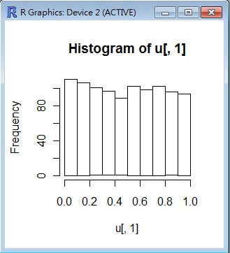
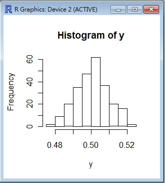
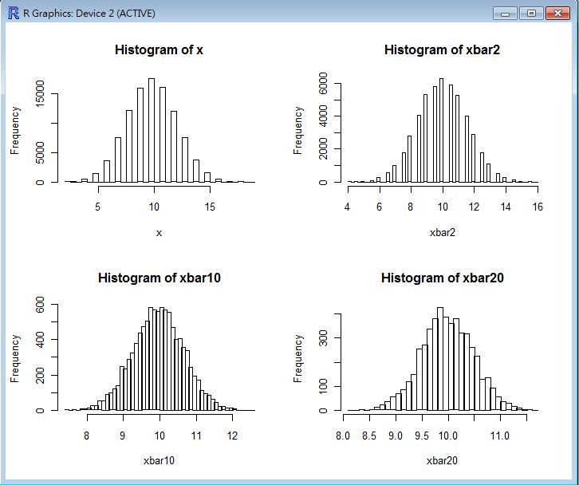
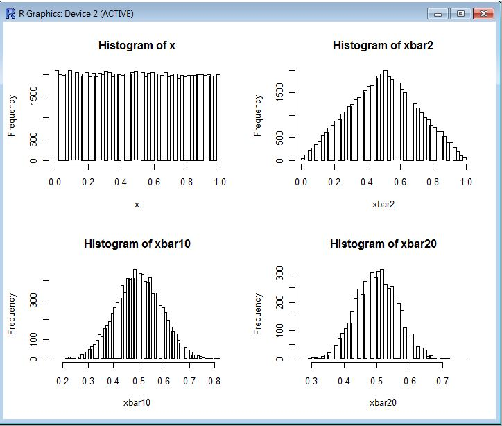
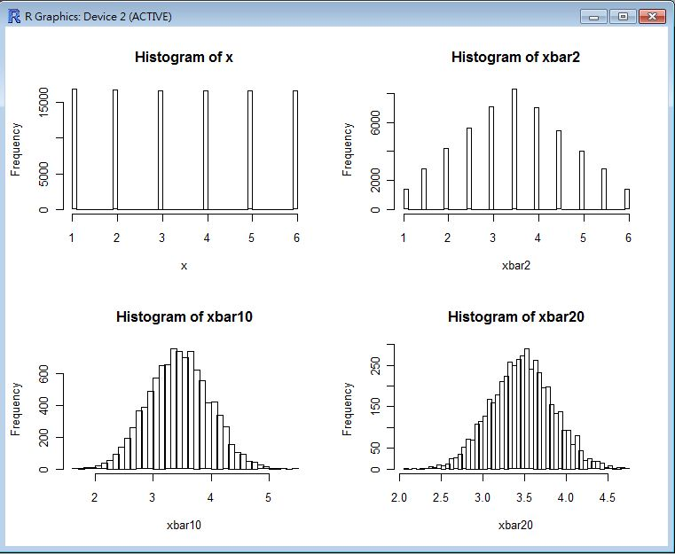

# 中央極限定理

中央極限定理是機率統計上最重要的定理之一，整個統計的估計與檢定幾乎都建立在這個定理之上，因此
對「中央極限定理」有清楚的理解是學好機率統計的一個關鍵。

在本章中，我們將利用 R 軟體實作並驗證「中央極限定理」，讓讀者能透過程式實際體會該定理的重要性與用途。

但是在說明中央極限定理之前，先讓我們來看看一個更簡單的數學定律，那就是大數法則。

## 大數法則

大數法則又稱大數律，是個數學與統計學的概念，意指數量越多，則其平均就越趨近母體平均數 $\mu$。

用數學的講法來說，也就是如下的公式成立。

> $ \bar{x}_n=\frac{x_1+x_2+...+x_n}{n} \to \mu$ ; 當 $n \to \infty$ 之時。

但是、在上述的趨近定義上，大數法則通常還可以分為強弱兩個版本，如下所示：

> 弱大數法則 (Weak law) :  $\lim_{n \to \infty} P( |\bar{x}_n - \mu| > \epsilon ) = 0$

弱大數法則的意義是說，當樣本數趨近於無限大時，樣本平均值會趨近於母體平均數 $\mu$。

> 強大數法則 (Strong law) : $P( \lim_{n \to \infty} |\bar{x}_n = \mu| ) = 1$

而強大數法則的意義則是說，當樣本數趨近於無限大時，樣本平均值等於母體平均數 $\mu$ 的機率為 1。

上述的大數法則只是說出一個傾向而已，而且 $n \to \infty$ 這個要求太過強烈，現實上是不可能達到的，
如果能夠找到有限樣本下的平均數之變動範圍限制，那會比這樣的無限大要求更好一些。

## 柴比雪夫不等式

柴比雪夫不等式給出了樣本分佈情況的一個限制條件，其數學公式如下所示：

$P(\mu - k \sigma < X < \mu + k \sigma) \ge 1- \frac{1}{k^2}$

柴比雪夫不等式所述說的，是樣本平均數與標準差之間的一個限制關係，這個關係不管在哪一種分佈之下，都一定會成立的。

* 與平均數 $\mu$ 相差至少 2 個標準差 ( $2\sigma$ ) 的樣本數目不多於 1/4。
* 與平均數 $\mu$ 相差至少 3 個標準差 ( $3\sigma$ ) 的樣本數目不多於 1/9。
* 與平均數 $\mu$ 相差至少 4 個標準差 ( $4\sigma$ ) 的樣本數目不多於 1/16。

* 與平均數 $\mu$ 相差至少 k 個標準差 ( $k\sigma$ ) 的樣本數目不多於 $1/k^2$。

舉例而言，假如一個 40 人的班上，同學的平均體重為 50 公斤，標準差為 10 公斤，那麼體重小於 30 公斤的人不可能會超過 10 人。

初步看起來，柴比雪夫不等式非常得奇怪，感覺很不合理，舉例而言，對於 n 個柏努力試驗的樣本，由於樣本值不是 0 就是 1，這樣
應該會不符合柴比雪夫不等式才對，但事實上卻會符合。

讓我們舉一個例子，假如 20 個伯努力試驗，共有十次成功，十次失敗，於是其平均值、變異數與標準差可計算如下：

* 平均值： $\mu = \bar{X} = \frac{0*10 + 1*10}{20} = 0.5$
* 變異數： $\sigma^2 = E[(X-\mu)^2] = \frac{(0-0.5)^2*10 + (1-0.5)^2*10}{20} = \frac{0.25 * 20}{20} = 0.25$
* 標準差： $\sigma = \sqrt{0.25} = 0.5$

因此，與平均數 $\mu=0.5$ 相差兩個標準差的情況根本就不存在 (也就是 $P(\mu - 2 \sigma < X < \mu + 2 \sigma)=0$ )，
所以柴比雪夫不等式在這樣分為兩個極端的分布上還是會成立的。

雖然柴比雪夫不等式給出了平均值的範圍限制，但是卻沒有給出平均值分佈的形狀，還好中央極限定理解決了這個問題。

## 中央極限定理簡介

以下是中央極限定理的數學式：

$\frac{x_1+x_2+...+x_n}{n}  = \bar{x} \rightarrow N(\mu, \sigma/\sqrt{n})$

如果用白話文陳述，那就是說 n 個樣本的平均數 $\frac{x_1+x_2+...+x_n}{n}=\bar{x}$ 會趨近於常態分布。

更精確一點的說，當您從某個母體 X 取出 n 個樣本，則這 n 個樣本的平均數 $\frac{x_1+x_2+...+x_n}{n}=\bar{x}$ 會趨近於以平均期望值 $\mu$ 為中心，
以母體標準差 $\sigma$  除以 $\sqrt{n}$ 的值 $\sigma/\sqrt{n}$ 為標準差的常態分布。

如果採用另一種正規化後的公式寫法，也可以將上述的「中央極限定理」改寫為： $\frac{\bar{x}-\mu}{\sigma/\sqrt{n}} \rightarrow Z$

其中的 Z 是指標準常態分部，也就是 $\frac{\bar{x}-\mu}{\sigma/\sqrt{n}}$ 會趨近標準常態分布。

## 中央極限定理的用途

根據上述的定義，我們知道當樣本數 n 足夠大時 (通常 20 個以上就夠大了)， n 個樣本的平均值 $\frac{x_1+x_2+...+x_n}{n}=\bar{x}$
會趨近於常態分布，換句話說也就是 $\frac{\bar{x}-\mu}{\sigma/\sqrt{n}}$ 會趨近於標準常態分布。

因此、當我們取得一組樣本之後，我們就可以計算其平均數 $\frac{x_1+x_2+...+x_n}{n}=\bar{x}$，如果有人告訴我們說母體的
平均數 $\mu$ 的值是多少，我們就可以看看 $\bar{x}$ 與 $\mu$ 是否差距很遠，如果差距很遠，
導致 $\bar{x}$ 來自平均數 $\mu$
母體的機率很小，那麼很可能是此組樣本是非常罕見的特例，或者該組樣本的抽樣有所偏差，也就是該組樣本很可能並非來自平均數為 $\mu$
的母體。

以下是一些標準常態分布的重要數值，

1. $P[-\sigma < X - \mu < \sigma] = 0.68$
2. $P[-2 \sigma < X - \mu < 2 \sigma] = 0.95$
3. $P[-3 \sigma < X - \mu < 3 \sigma] = 0.997$
4. $P[-4 \sigma < X - \mu < 4 \sigma] = 0.99993$
5. $P[-5 \sigma < X - \mu < 5 \sigma] = 0.9999994$
6. $P[-6 \sigma < X - \mu < 6 \sigma] = 0.999999998$


```R
> pnorm(1)-pnorm(-1)
[1] 0.6826895
> pnorm(2)-pnorm(-2)
[1] 0.9544997
> pnorm(3)-pnorm(-3)
[1] 0.9973002
> pnorm(4)-pnorm(-4)
[1] 0.9999367
> pnorm(5)-pnorm(-5)
[1] 0.9999994
> pnorm(6)-pnorm(-6)
[1] 1
> options(digits=10)
> pnorm(6)-pnorm(-6)
[1] 0.999999998
```

從上面的數值您可以看出來，管理學上所謂的六標準差其實是很高的一個要求，也就是良率必須要達到 99.9999998% 以上才行。

如果您今天所取的 n 個樣本，與母體平均數 $\mu$ 距離兩個標準差以上，那就很可能有問題了，這種推論稱為檢定，我們可以用 R 軟體中的
t.test 函數來檢驗這件事，我們將在下一期當中說明如何用 R 軟體進行統計檢定的主題，讓我們先將焦點移回到中央極限定理身上，用 R 軟體
來驗證該定理。

## R 程式範例：驗證中央極限定理

```R
> u <- matrix ( runif(500000), 50, 10000 )
> y <- apply ( u, 2, mean )
> hist(u[,1])
> hist(y)
> ?apply
> 
```

說明：

1. u 乃是將 50 萬個 uniform 樣本分配成 50*10000 的矩陣，
2. y 對 u 進行列統計 apply ( u, 2, mean ) 代表對每行取平均值 mean(col of u) 的結果。
3. 因此 y 代表從 Uniform Distribution 中每次取出 50 個樣本，然後進行加總平均的結果，也就是  $\frac{x_1+x_2+...+x_{50}}{50}$ 。
4. 從下列的 hist(y) 圖形中，我們可以看到中央極限定理的證據：也就是  $\frac{x_1+x_2+...+x_{50}}{50}$ 會趨向常態分布。






```R
CLT = function(x) {
  op<-par(mfrow=c(2,2)) # 設為 2*2 的四格繪圖版
  hist(x, nclass=50)	 # 繪製 x 序列的直方圖 (histogram)。
  m2 <- matrix(x, nrow=2, )	 # 將 x 序列分為 2*k 兩個一組的矩陣 m2。
  xbar2 <- apply(m2, 2, mean)	# 取每兩個一組的平均值 (x1+x2)/2 放入 xbar2 中。
  hist(xbar2, nclass=50)	 # 繪製 xbar2 序列的直方圖 (histogram)。
  m10 <- matrix(x, nrow=10, )	# 將 x 序列分為 10*k 兩個一組的矩陣 m10。
  xbar10 <- apply(m10, 2, mean)	# 取每10個一組的平均值 (x1+..+x10)/10 放入 xbar10 中。
  hist(xbar10, nclass=50)	 # 繪製 xbar10 序列的直方圖 (histogram)。
  m20 <- matrix(x, nrow=20, )	# 將 x 序列分為 25*k 兩個一組的矩陣 m25。
  xbar20 <- apply(m20, 2, mean)	# 取每20個一組的平均值 (x1+..+x20)/20 放入 xbar20 中。
  hist(xbar20, nclass=50)	 # 繪製 xbar20 序列的直方圖 (histogram)。
}

CLT(rbinom(100000, 20, 0.5)) # 用參數為 n=20, p=0.5 的二項分布驗證中央極限定理。
CLT(runif(100000)) # 用參數為 a=0, b=1 的均等分布驗證中央極限定理。
CLT(rpois(100000, 4)) # 用參數為 lambda=4 的布瓦松分布驗證中央極限定理。
CLT(rgeom(100000, 0.5)) # 用參數為 n=20, m=10, k=5 的超幾何分布驗證中央極限定理。
CLT(rhyper(100000, 20, 10, 5)) # 用參數為 p=0.5 的幾何分布驗證中央極限定理。
CLT(rnorm(100000)) # 用參數為 mean=0, sd=1 的標準常態分布驗證中央極限定理。
CLT(sample(1:6, 100000, replace=T))	# 用擲骰子的分布驗證中央極限定理。
CLT(sample(0:1, 100000, replace=T))	# 用丟銅板的分布驗證中央極限定理。
```

以下是這些指令的執行結果，從這些圖中您可以看到當樣本數到達 20 個的時候，幾乎每種樣本都會趨向常態分布。









## 結語

在本節當中，我們沒有證明「大數法則、柴比雪夫不等式、中央極限定理」等數學定律，只用了 R 軟體來驗證中央極限定理，
如果對數學比較有興趣的同學，可以參考以下參考文獻中維基百科的證明。

## 參考文獻
* [The Central Limit Theorem (Part 1)](http://msenux.redwoods.edu/math/R/CentralLimit.php)
* [洋洋 -- 淺談機率上的幾個極限定理](http://episte.math.ntu.edu.tw/articles/mm/mm_09_3_07/index.html)
* Proof of Central Limit Theorem, H. Krieger, Mathematics 157, Harvey Mudd College, Spring, 2005
    * <http://www.math.hmc.edu/~krieger/m157cltproof.pdf>
* Wikipedia:[Law of large numbers](http://en.wikipedia.org/wiki/Law_of_large_numbers) (有證明柴比雪夫不等式與大數法則)
* Wikipedia:Chebyshev's inequality -- <http://en.wikipedia.org/wiki/Chebyshev's_inequality>
* Wikipedia:[Central limit theorem](http://en.wikipedia.org/wiki/Central_limit_theorem) (有證明中央極限定理)
* 維基百科：[大數定律](http://zh.wikipedia.org/wiki/%E5%A4%A7%E6%95%B0%E5%AE%9A%E5%BE%8B)
* 維基百科：[切比雪夫不等式](http://zh.wikipedia.org/wiki/%E5%88%87%E6%AF%94%E9%9B%AA%E5%A4%AB%E4%B8%8D%E7%AD%89%E5%BC%8F) (有證明柴比雪夫不等式)
* 維基百科：[中央極限定理](http://zh.wikipedia.org/wiki/%E4%B8%AD%E5%BF%83%E6%9E%81%E9%99%90%E5%AE%9A%E7%90%86)
* Two Proofs of the Central Limit Theorem, Yuval Filmus, January/February 2010
    * <http://www.cs.toronto.edu/~yuvalf/CLT.pdf>
