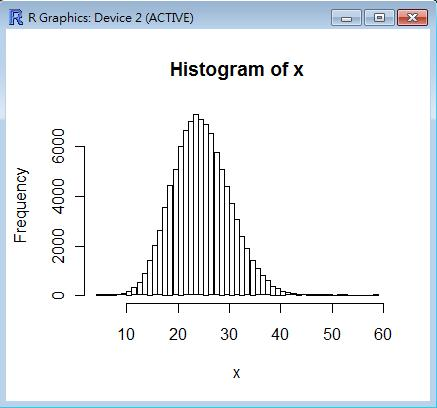

## 負二項分布 (Netative binomial distribution)

公式：$f(x) = {x-1 \choose r-1} (1-p)^{x-r} p^r$

範圍：r=1,2,3,.... ; x= r, r+1, r+2, ....

意義：要得到第 r 次成功所需要的試驗次數 x; 

R 函數： nbinom(size, prob) ; r:size:成功數, p:prob:成功機率

* <http://stat.ethz.ch/R-manual/R-patched/library/stats/html/NegBinomial.html>

特性

1. $E(X) = r/p$
2. $Var(X) = r (1-p)/p^2 = r q/p^2$

動差生成函數：$m_x(t) = \frac{(pe^t)^r}{(1-(1-p) e^t)^r} = \frac{(p e^t)^r}{(1-q e^t)^r}$

### 習題

1. 請問丟公平的銅板時，在得到第三次正面的要求下，其投擲次數 x 的機率分布為何？該分布的期望值為何？

2. 請問丟公平的銅板時，在得到第 r 次正面的要求下，其投擲次數 x 的機率分布為何？該分布的期望值為何？

### R 程式範例：負二項分布曲線圖

```R
> n=20; p=0.4; k=seq(0,50)
> plot(k, dnbinom(k,n,p), type='h', main='dnbinom(k,n=20,p=0.4)', xlab='k')
>  
```


```R
> x = rnbinom(100000, 100, 0.8)
> hist(x, nclass=max(x)-min(x)+1)
> 
```



### R 程式範例 (進階)

```R
require(graphics)
x <- 0:11
dnbinom(x, size = 1, prob = 1/2) * 2^(1 + x) # == 1
126 /  dnbinom(0:8, size  = 2, prob  = 1/2) #- theoretically integer

## Cumulative ('p') = Sum of discrete prob.s ('d');  Relative error :
summary(1 - cumsum(dnbinom(x, size = 2, prob = 1/2)) /
                  pnbinom(x, size  = 2, prob = 1/2))

x <- 0:15
size <- (1:20)/4
persp(x,size, dnb <- outer(x, size, function(x,s) dnbinom(x,s, prob= 0.4)),
      xlab = "x", ylab = "s", zlab="density", theta = 150)
title(tit <- "negative binomial density(x,s, pr = 0.4)  vs.  x & s")

image  (x,size, log10(dnb), main= paste("log [",tit,"]"))
contour(x,size, log10(dnb),add=TRUE)

## Alternative parametrization
x1 <- rnbinom(500, mu = 4, size = 1)
x2 <- rnbinom(500, mu = 4, size = 10)
x3 <- rnbinom(500, mu = 4, size = 100)
h1 <- hist(x1, breaks = 20, plot = FALSE)
h2 <- hist(x2, breaks = h1$breaks, plot = FALSE)
h3 <- hist(x3, breaks = h1$breaks, plot = FALSE)
barplot(rbind(h1$counts, h2$counts, h3$counts),
        beside = TRUE, col = c("red","blue","cyan"),
        names.arg = round(h1$breaks[-length(h1$breaks)]))
```

執行結果：

```R
> require(graphics)
> x <- 0:11
> dnbinom(x, size = 1, prob = 1/2) * 2^(1 + x) # == 1
 [1] 1 1 1 1 1 1 1 1 1 1 1 1
> 126 /  dnbinom(0:8, size  = 2, prob  = 1/2) #- theoretically integer
[1]   504.0   504.0   672.0  1008.0  1612.8  2688.0  4608.0  8064.0 14336.0
> 
> ## Cumulative ('p') = Sum of discrete prob.s ('d');  Relative error :
> summary(1 - cumsum(dnbinom(x, size = 2, prob = 1/2)) /
+                   pnbinom(x, size  = 2, prob = 1/2))
     Min.   1st Qu.    Median      Mean   3rd Qu.      Max. 
-2.22e-16 -2.22e-16 -2.22e-16 -1.48e-16  0.00e+00  0.00e+00 
> 
> x <- 0:15
> size <- (1:20)/4
> persp(x,size, dnb <- outer(x, size, function(x,s) dnbinom(x,s, prob= 0.4)),
+       xlab = "x", ylab = "s", zlab="density", theta = 150)
> title(tit <- "negative binomial density(x,s, pr = 0.4)  vs.  x & s")
> 
> image  (x,size, log10(dnb), main= paste("log [",tit,"]"))
> contour(x,size, log10(dnb),add=TRUE)
> 
> ## Alternative parametrization
> x1 <- rnbinom(500, mu = 4, size = 1)
> x2 <- rnbinom(500, mu = 4, size = 10)
> x3 <- rnbinom(500, mu = 4, size = 100)
> h1 <- hist(x1, breaks = 20, plot = FALSE)
> h2 <- hist(x2, breaks = h1$breaks, plot = FALSE)
> h3 <- hist(x3, breaks = h1$breaks, plot = FALSE)
> barplot(rbind(h1$counts, h2$counts, h3$counts),
+         beside = TRUE, col = c("red","blue","cyan"),
+         names.arg = round(h1$breaks[-length(h1$breaks)]))
```

繪圖結果：


### 參考文獻
* [Wikipedia:負二項分布](http://zh.wikipedia.org/wiki/%E8%B2%A0%E4%BA%8C%E9%A0%85%E5%88%86%E4%BD%88)
* [Wikipedia:Negative_binomial_distribution](http://en.wikipedia.org/wiki/Negative_binomial_distribution)

