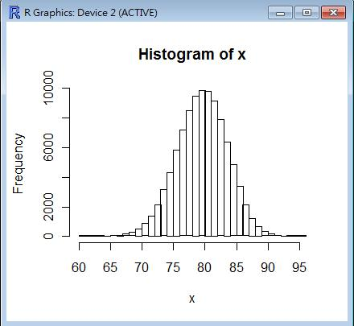
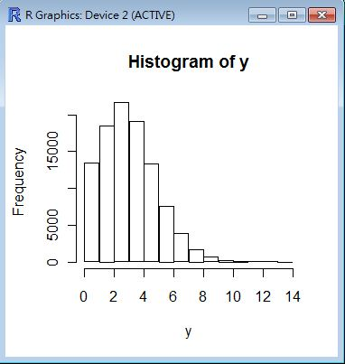
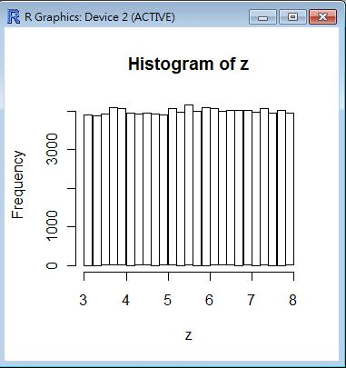
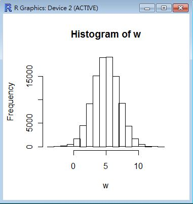
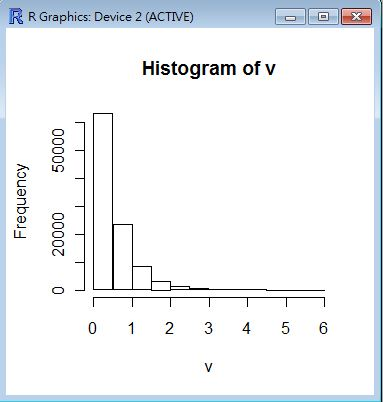
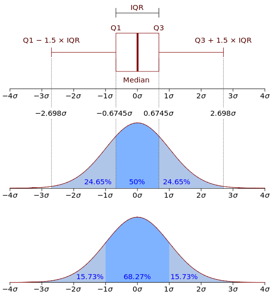
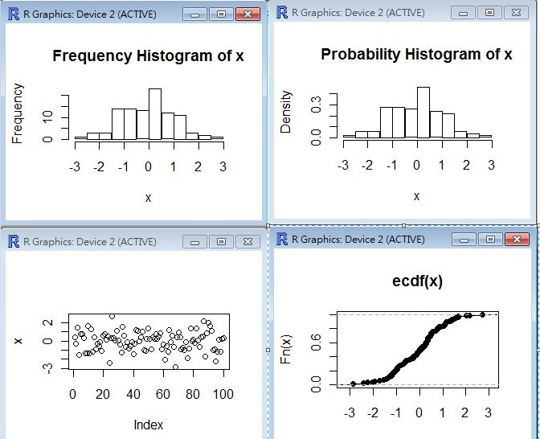
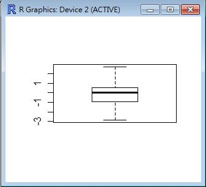

# 抽樣與敘述統計

## 隨機抽樣

統計的基礎是抽樣，所謂的抽樣就是從母體 (一大群樣本) 當中抽出一些樣本，而在抽樣的時候，我們通常會盡可能的確保樣本的隨機性，以避免抽到的樣本有所偏差。

簡單來說，抽樣是從一群東西(母體) 當中隨機抽取出 x1, x2, ...., xn 等 n 個觀察值的過程，表示如下：

    母體 => (獨立性) X1, X2, .... , Xn 等 n 個隨機變數相互獨立 => 取出 x1, x2, ...., xn 等 n 個觀察值。
   
在電腦上，我們可以很容易的模擬隨機抽樣，以下是一個使用 R 軟體模擬隨機抽樣的範例，其中指令 sample(1:100, 10) 代表從 1 到 100 的整數當中取出 10 個樣本出來。
   
```R
> x = sample(1:100, 10)
> x
 [1] 12 17 50 33 98 77 39 79  7 26
```

sample 函數的原型是 `sample(x, size, replace = FALSE, prob = NULL)`，如果 replace 設定為 FALSE，代表已經取過就會被去除，不能重複出現；反之則可以重複出現。

在統計學中，有一些常用的機率模型，都有對應的 R 函數，以下是一些最常用的機率模型之整理。


| 機率模型 | 密度函數 | R 函數名稱 | 說明 |
|----------|----------|------------|------|
| 二項分布 | ${n \choose x} p^x (1-p)^{n-x}$ | binom(n:size, p:prob) | n:樣本數, p:正面機率, <br/> n 次試驗中有 x 個成功的機率 |
| 布瓦松分布   | $\frac{e^{-\lambda} {\lambda}^x}{x!}$ | pois(lambda) | 在每單位區域內，事件出現平均 $\lambda$ 次 |
| 均勻分布 (Uniform) | $\frac{1}{b-a}$ | unif(a:min, b:max) | a:範圍下限, b: 上限 <br/> 出現機會均等 |
| 常態分布(Normal) | $\frac{1}{\sqrt{2\pi} \sigma} e^{- \frac{1}{2} [(x-\mu)/\sigma]^2}$ | norm(mean, sd) | 中央極限定理：x1+x2+...+xk; 當 k 越大就越接近常態分布 | 
| 指數分布  (Exponential)| $\frac{1}{b} e^{-x/b}$ | exp(rate) | 伽瑪分布($a=1, b=\frac{1}{\lambda}$) <br/> 布瓦松過程中，第一次事件出現的時間 W |

對於每個機率模型，您只要在該函數前若加入 r 這個字，就可以用來產生隨機樣本，以下是一些隨機樣本的產生範例。

```R
> rbinom(20, 5, 0.5)
 [1] 4 3 3 4 2 4 3 1 2 3 4 3 2 2 2 4 2 3 1 1
> rpois(20, 3.5)
 [1] 2 1 4 2 1 6 3 6 1 3 3 6 6 0 4 2 6 4 6 2
> runif(20, min = 3, max = 8)
 [1] 3.933526 3.201883 7.592147 5.207603 4.897806 3.848298 4.521461 4.437873
 [9] 3.655640 5.633540 6.557995 5.430671 6.502675 5.637283 7.713699 5.841052
[17] 6.859493 5.987991 3.752924 7.480678
> rnorm(20, mean = 5.0, sd = 2.0)
 [1] 6.150209 4.743013 3.328734 5.096294 4.922795 6.272768 4.862825 8.036376
 [9] 4.198432 5.467984 2.046450 6.452511 2.088256 5.349187 3.074408 3.628072
[17] 3.421388 7.242598 3.125895 9.865341
> rexp(20, rate=2.0)
 [1] 0.17667426 0.49729383 0.12786107 0.13983412 0.44683515 1.30482842
 [7] 0.28512544 1.61472266 0.23220649 0.39089780 0.05947224 1.42892610
[13] 0.02555552 0.69409186 0.68228242 0.22542362 0.33590791 0.14684937
[19] 0.34995146 0.80595369
```

為了讓讀者能確認這些指令所產生的圖形確實符合分布，讓我們用這些隨機抽樣函數各產生 100,000 個樣本，
然後用 hist() 這個函數繪製統計圖，就能看出這些抽樣函數的效果了，以下是我們的抽樣指令與結果圖形。

```R
> x = rbinom(100000, 5, 0.5)
> hist(x)
```



```R
> y = rpois(100000, 3.5)
> hist(y)
```



```R
> z = runif(100000, min=3, max=8)
> hist(z)
```



```R
> w = rnorm(100000, mean=5.0, sd=2.0)
> hist(w)
```



```R
> v = rexp(100000, rate=2.0)
> hist(v)
```




## 單組樣本的敘述統計

敘述統計乃是隨機抽樣的樣本集合，進行某些計算與繪圖，以便忠實的呈現出樣本的某些特性。這些計算出的數值，以及呈現出來的圖形，可以反映出樣本的某些統計特性，讓統計者能透過數值或圖形，大致了解樣本的統計特徵。


| 中文名稱       | 英文名稱                  | 數學公式 / 說明                                                                                                   |
|----------------|---------------------------|-------------------------------------------------------------------------------------------------------------------|
| 樣本平均數     | Mean                      | $\bar{X} = \frac{\sum_{i=1}^n X_i}{n}$                                                                            |
| 樣本中位數     | Median                    | 樣本排序後最中間位置的數值                                                                                        |
| 樣本變異數     | Sample Variance           | $S^2 = \sum_{i=1}^n \frac{(X_i - \bar{X})^2}{n-1} = \frac{n \sum_{i=1}^n X_i^2 - (\sum_{i=1}^n Xi)^2}{n (n-1)}$   |
| 樣本標準差     | Sample Standard Deviation | 樣本變異數中的 S 稱為樣本標準差，也就是 $\sqrt{S^2}$                                                              |
| 樣本全距       | Range                     | 樣本中最大的觀察值減去最小的觀察值 $\omega = X_H-X_L$                                                             |
| 離群值         | Outlier 或 Wild           | 離其他樣本很遠，特別大或特別小的樣本值                                                                            |
| 樣本四分數間距 | InterQuartile Range, IQR  | 第 3 四分位數減掉第 1 四分位數 $IQR = q_3 - q_1$                                                                  |


> 注意：變異數的定義為 $\delta^2 = E[(X-\mu)^2]$，上述的樣本變異數必須除以 n-1 才是變異數的不偏估計量，而不是除以 n (這是因為我們並不知道母體真正的 $\mu$ 值是多少，因此採用了 $X-\bar{X}$ 來代替 $X-\mu$ ，但是這樣就會造成多減掉
一份樣本的效應，於是分母就必須除以 n-1 了)。


範例：請寫出樣本序列 (7 4 6 8 9 4 5 6 2 8) 的以下敘述統計值與其計算過程。

1. 樣本平均數 (Mean)
2. 樣本變異數 (Sample Variance)
3. 樣本標準差 (Sample Standard Deviation)
4. 中位數 (Median)
5. 全距 (Range)
6. 第一四分位數 (q1)
7. 第三四分位數 (q3)
8. 樣本四分數間距 (iqr)

解答：

1. 樣本平均數 (Mean)

> mean(x) = (7+4+6+8+9+4+5+6+2+8)/10 = 5.9

2. 樣本變異數 (Sample Variance)

> $var(x) = \frac{(7-5.9)^2+(4-5.9)^2+(6-5.9)^2+(8-5.9)^2+(9-5.9)^2+(4-5.9)^2+(5-5.9)^2+(6-5.9)^2+(2-5.9)^2+(8-5.9)^2}{10-1} = 4.77$

3. 樣本標準差 (Sample Standard Deviation)

> $S = sqrt(var(x)) = sqrt(4.77)$

4. 中位數 (Median)

> M =  (2 4 4 5 6 6 7 8 8 9) 最中間的值 = (6+6)/2 = 6

5. 全距 (Range)

> range(x) = 9-2 = 7

6. 第一四分位數 (q1)

 
> 順序 0 1 2 3 4 5 6 7 8 9
> 
> 樣本 2 4 4 5 6 6 7 8 8 9
> 
> 
> q1 的位置 0.25 * 9/10 = 0.225
> 
> 所以 q1 = 4+0.25 * (5-4) = 4.25

7. 第三四分位數 (q3)

> q3 的位置 0.75 * 9/10 = 0.675
> 
> 所以 q3 = 7+0.75 * (8-7) = 7.75

8. 樣本四分數間距 (iqr)

> iqr(x) = q3-q1 = 7.75-4.25 = 3.5


使用 R 軟體進行驗證

```R
> x = sample(1:100, 10)
> x
 [1] 12 17 50 33 98 77 39 79  7 26
> mean(x)
[1] 43.8
> median(x)
[1] 36
> var(x)
[1] 984.1778
> sd(x)
[1] 31.37161
> range(x)
[1]  7 98
> max(x)
[1] 98
> min(x)
[1] 7
> max(x)-min(x)
[1] 91
> q1 = quantile(x, 0.25)
> q1
  25% 
19.25 
> q3 = quantile(x, 0.75)
> q3
  75% 
70.25 
> q3-q1
75% 
 51 
> iqr(x)
錯誤: 沒有這個函數 "iqr"
> IQR(x)
[1] 51
> fivenum(x)
[1]  7 17 36 77 98
> summary(x)
   Min. 1st Qu.  Median    Mean 3rd Qu.    Max. 
   7.00   19.25   36.00   43.80   70.25   98.00 
```

習題：請用 R 軟體計算出樣本序列 (8.9 , 4.5 , 3.7 , 10.0 , 11.5 , 8.9 , 5.6 , 15.4 , 16.6 , 1.0) 的以下敘述統計值 (必須寫出指令與結果)。

1. 樣本平均數 (Mean)

2. 樣本變異數 (Sample Variance)

3. 樣本標準差 (Sample Standard Deviation)

4. 中位數 (Median)

5. 全距 (Range)

6. 第一四分位數 (q1)

7. 第三四分位數 (q3)

8. 樣本四分數間距 (iqr)

解答：

```R
[1] 25.37433
> sd(x)
[1] 5.037294
> median(x)
[1] 8.9
> max(x)-min(x)
[1] 15.6
> q1 = quantile(0.25, x)
錯誤在quantile.default(0.25, x) : 'probs' outside [0,1]
> q1 = quantile(x, 0.25)
> q1
  25% 
4.775 
> q3 = quantile(x, 0.75)
> q3
   75% 
11.125 
> q3-q1
 75% 
6.35 
> IQR(x)
[1] 6.35
> 
```

## 繪製統計圖

| 中文名稱           | 英文名稱                            |R 指令       | 說明                                                            |
|--------------------|-------------------------------------|-------------|-----------------------------------------------------------------|
| 直方圖             | Histogram                           |hist(x)      | 根據每個區間的樣本出現次數繪製的長條圖。                        |
| 莖葉圖             | Stem-and-Leaf Diagram               |stem(x)      | 用主幹數字與分支數字表示分布情況的圖形。                        |
| 盒型圖             | Boxplots                            |boxplot(x)   | 由平均值、內籬笆與外籬笆所形成的盒型圖，可看出中心點與離散程度。|
| 肩型圖 (累加分配圖)| Relative Cumulative Frequency Ogive |plot(ecdf(x))| 將累加次數繪製出來的圖形。                                      |

說明：盒型圖是由四分位數 q1, q3, 以及內籬笆 f1, f3 (inner fences), 連接值 a1, a3 與外籬笆 F1, F3 (outer fances) 所組成的圖形

* 內籬笆：f1 = q1 - 1.5 iqr; f3 = q3 + 1.5 iqr; 
* 外籬笆：F1 = q1 - 3.0 iqr; F3 = q3 + 3.0 iqr; 
* 連接值：a1 是大於且最接近 f1 的數據點; a3 小於且最接近 f3 的數據點。

盒型圖的畫法請參考下列圖形：



R 操作範例 : 統計圖

```R
> x = rnorm(100)
> x
  [1]  0.389381081 -0.274522826  1.492670583 -1.563228609  0.766405108
  [6]  0.736573742  0.297407135 -1.324130406 -1.376598231  1.661727175
 [11] -1.356590351  1.309122339 -1.193821085  0.365801091 -0.952034088
 [16] -0.277610568 -0.599980091 -0.124105876 -1.107713162  0.560637570
 [21]  0.714449138  0.111969057  0.505171739 -2.418297599  0.318797182
 [26]  2.716646516  0.345289422  0.019434615  1.087758951  0.033917165
 [31] -0.356786424 -1.284809066  1.580411327  0.552931291 -0.615928762
 [36] -0.087069820 -0.814632197 -0.570882510 -0.107731447 -1.453838416
 [41] -0.257115209  1.166866120  1.072692716 -0.022594852  0.441221144
 [46]  1.053900960 -1.025193547 -1.119200587  0.264668203  1.409504515
 [51]  0.241644132 -0.955407800  0.446297381  0.231887649  0.769308731
 [56]  0.269624579  0.496109294  0.822638573 -0.904380789 -0.429527404
 [61] -2.050582772 -0.586973281 -1.192753403  1.158321933 -0.151319360
 [66]  0.558858868 -0.656174351 -2.858964403  0.366785049  0.896958092
 [71]  0.369315063 -0.953560954 -0.762608370 -1.017449547 -0.127738562
 [76] -1.922030980 -0.839897930  1.332972530 -0.001151104  0.104336360
 [81] -0.208907813  1.401335798  0.019330593 -0.687559289  0.445371885
 [86]  0.504532689  2.168626000 -1.742886230  0.831058071  2.011604088
 [91]  1.676059594  1.132849957 -1.047073217 -0.912548540 -2.235854777
 [96] -1.194104128  0.121106118 -1.178415224  0.214196778  0.280714044
> stem(x)

  The decimal point is at the |

  -2 | 9421
  -1 | 97654433222211000000
  -0 | 998887766664433322111100
   0 | 00011122233333344444445556667788889
   1 | 11112233445677
   2 | 027

> hist(x, main="Frequency Histogram of x")

> hist(x, main="Probability Histogram of x", freq=F)

> Fx = ecdf(x)

> plot(x)

> plot(Fx)

> boxplot(x)
```





以上都是對於單組樣本的統計數字與圖形，以下將討論兩組樣本的統計數字

## 共變異數、兩組樣本的相關度統計

兩組樣本的統計數字，最重要的就是共變異數 (covariance) 相關係數 (correlation) 與了。

共變異數是兩組樣本 X, Y 的樣本與期望值之間差的乘積之期望值，而相關係數則共變異數經過
正規化後的結果，用來表示兩組樣本相關程度，其數值介於 -1.0 到 1.0 之間。

中文名稱      英文名稱         R 指令                     數學公式 / 說明
------------  ---------------  ----------------           -----------------------------------------------------
共變異數      covariance       cov(x,y)                   $\gamma_{XY} =E[ (X-E[X])\,(Y-E[Y])]$
相關係數      correlation      cor(x,y)                   $\phi_{XY}  =E[ (X-E[X])(Y-E[Y])]/(\sigma_X \sigma_Y)$


讓我們看看 R 軟體中的共變異數函數 cov() 與相關係數 cor() 的操作，如下所示：

```R
 runif(10, 1, 5)
> x
 [1] 1.375135 1.863417 2.403693 2.639902 1.694610 4.419406 4.032262 2.147783
 [9] 1.501733 1.497732
> cov(x, x)
[1] 1.144697
> cov(x, x+1)
[1] 1.144697
> cor(x, x)
[1] 1
> cor(x, x+1)
[1] 1
> cov(x, -x)
[1] -1.144697
> cor(x, -x)
[1] -1
> cor(x, 0.5*x)
[1] 1
> y = runif(10, 1, 5)
> y
 [1] 1.114662 2.358270 2.089179 4.581484 4.170922 2.630044 1.450336 1.320637
 [9] 1.705649 3.506064
> cor(x, y)
[1] -0.04560485
> cor(y, y)
[1] 1
> 

```


