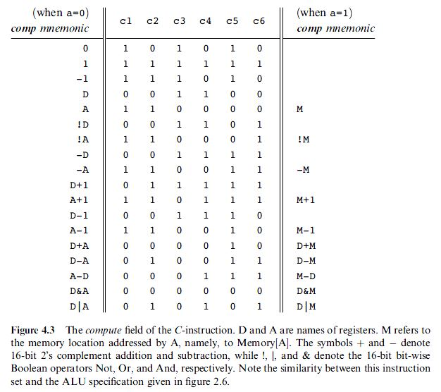
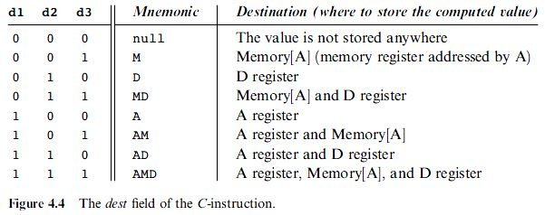
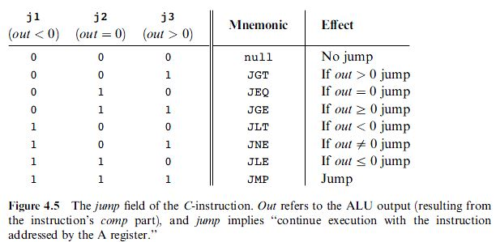
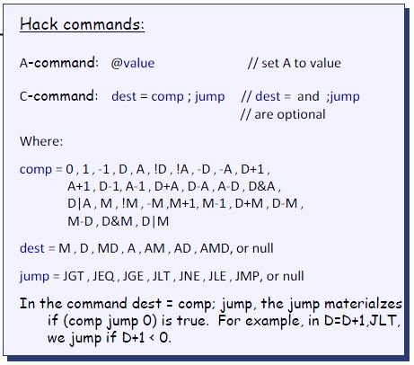

# Nand2Tetris 第四週 -- 機器語言

聲明： 本文圖片取材自 nand2tetris 這門課程的官方網站 <http://www.nand2tetris.org/> ，該網站的軟體為 open source GPL 授權，但文件內容並沒有開放原始碼或使用創作共用授權，本文截圖純粹依賴著作權法的合理使用範圍，若您認為有侵權請告訴我們，我們會配合修改文章或移除圖片，我們希望能完全符合著作權法的規定。（雖然有時要 100% 遵守著作權法真的相當困難）

## 指令格式與寫法

HackCPU 的有兩種型態的指令，第一種是 A 型態的指令，用來指定某個記憶體位址


在組合語言中，其寫法是用 @ 符號開頭的，如下所示：

```
@value // 代表 A=value
```

而 C 型態的指令則用來進行運算，其指令格式如下：









上述的兩類指令可以總結如下圖：



其中的 A 指令會改變 A 暫存器，並以 A 為位址將資料讀入 M 當中。

而 C 指令比較複雜，其功能總結如下圖。


## 範例

```
@3      // A = 3
D = M   // D = M = memory[A] = memory[3]
@5      // A = 5
D = D-A // D = D-5
@100    // A = 100
D; JEQ  // if (D==0) goto 100      ; goto 會跳到 A 暫存器的位址。
@200    // A = 200
0; JMP  // goto 200
```


## 符號

R0 .. R15 分別代表 0 .. 15，這只是為了閱讀方便而已。

組譯器預先定義了一些特殊符號，其中 SCREEN 代表位址 16384，這是螢幕記憶體映射區的開頭。而 KBD 代表位址 24576 ，這是鍵盤碼的記憶體映射位址。


## 記憶體映射

